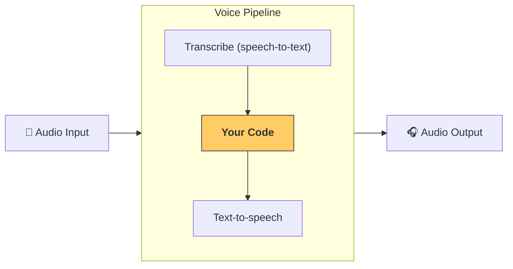

---
search:
  exclude: true
---
# パイプラインとワークフロー

[`VoicePipeline`][agents.voice.pipeline.VoicePipeline] は、エージェントベースのワークフローを音声アプリへ簡単に変換できるクラスです。ワークフローを渡すだけで、入力音声の文字起こし、話し終わりの検知、適切なタイミングでのワークフロー呼び出し、そしてワークフロー出力を音声へ戻す処理までをパイプラインが自動で行います。



## パイプラインの設定

パイプラインを作成する際には、次の項目を設定できます。

1. [`workflow`][agents.voice.workflow.VoiceWorkflowBase]  
   新しい音声が文字起こしされるたびに実行されるコードです。  
2. [`speech-to-text`][agents.voice.model.STTModel] と [`text-to-speech`][agents.voice.model.TTSModel] モデル  
3. [`config`][agents.voice.pipeline_config.VoicePipelineConfig]  
   ここでは以下のような内容を設定できます。  
   - モデル名をモデルへマッピングするモデルプロバイダー  
   - トレーシングの有効・無効、音声ファイルのアップロードの有無、ワークフロー名、トレース ID などのトレーシング設定  
   - プロンプト、言語、使用するデータ型など、TTS と STT モデルの設定  

## パイプラインの実行

パイプラインは [`run()`][agents.voice.pipeline.VoicePipeline.run] メソッドで実行できます。音声入力は次の 2 つの形式で渡せます。

1. [`AudioInput`][agents.voice.input.AudioInput]  
   完全な音声の文字起こしが既にある場合に使用します。録音済み音声や、プッシュ・トゥ・トークのようにユーザーが話し終わるタイミングが明確なアプリで便利です。  
2. [`StreamedAudioInput`][agents.voice.input.StreamedAudioInput]  
   ユーザーが話し終わったタイミングを検知する必要がある場合に使用します。音声チャンクを逐次送信でき、パイプラインが「アクティビティ検知」により適切なタイミングでエージェントワークフローを自動実行します。  

## 結果

音声パイプライン実行の結果は [`StreamedAudioResult`][agents.voice.result.StreamedAudioResult] です。このオブジェクトからイベントをストリーミング形式で受け取れます。[`VoiceStreamEvent`][agents.voice.events.VoiceStreamEvent] には次の種類があります。

1. [`VoiceStreamEventAudio`][agents.voice.events.VoiceStreamEventAudio]  
   音声チャンクを含みます。  
2. [`VoiceStreamEventLifecycle`][agents.voice.events.VoiceStreamEventLifecycle]  
   ターン開始や終了などのライフサイクルイベントを通知します。  
3. [`VoiceStreamEventError`][agents.voice.events.VoiceStreamEventError]  
   エラーイベントです。  

```python

result = await pipeline.run(input)

async for event in result.stream():
    if event.type == "voice_stream_event_audio":
        # play audio
    elif event.type == "voice_stream_event_lifecycle":
        # lifecycle
    elif event.type == "voice_stream_event_error"
        # error
    ...
```

## ベストプラクティス

### 割り込み

Agents SDK には現在、[`StreamedAudioInput`][agents.voice.input.StreamedAudioInput] に対する組み込みの割り込み機能はありません。そのため検知された各ターンごとにワークフローが個別に実行されます。アプリケーション側で割り込みを扱いたい場合は、[`VoiceStreamEventLifecycle`][agents.voice.events.VoiceStreamEventLifecycle] を監視してください。`turn_started` は新しいターンが文字起こしされ、処理が開始されたことを示します。`turn_ended` は該当ターンの音声がすべて送信された後に発火します。モデルがターンを開始したタイミングでマイクをミュートし、ターンに関連する音声をすべて送信し終えた後にアンミュートするといった制御が可能です。