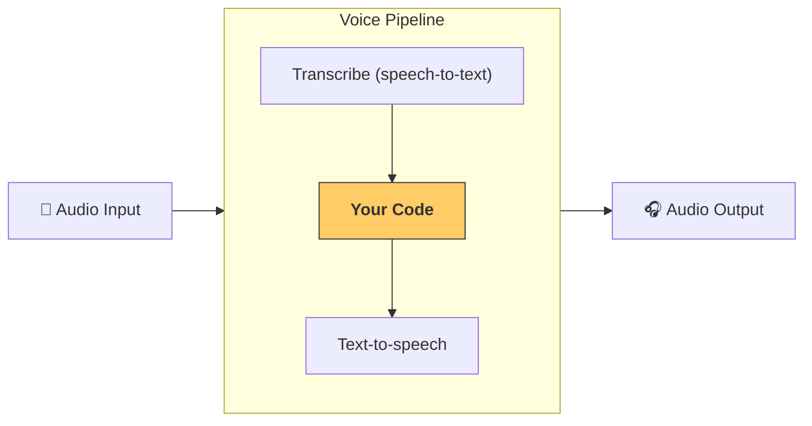

---
search:
  exclude: true
---
# パイプラインとワークフロー

[`VoicePipeline`][agents.voice.pipeline.VoicePipeline] は、エージェント型のワークフローを音声アプリに変換しやすくするクラスです。実行するワークフローを渡すと、入力音声の文字起こし、音声終了の検知、適切なタイミングでのワークフロー呼び出し、そしてワークフロー出力の音声化までをパイプラインが処理します。



## パイプラインの設定

パイプライン作成時に、次の設定が可能です:

1. [`workflow`][agents.voice.workflow.VoiceWorkflowBase]: 新しい音声が文字起こしされるたびに実行されるコード
2. 使用する [`speech-to-text`][agents.voice.model.STTModel] と [`text-to-speech`][agents.voice.model.TTSModel] のモデル
3. [`config`][agents.voice.pipeline_config.VoicePipelineConfig]: 次のような設定が可能です
    - モデルプロバイダー: モデル名をモデルにマッピング
    - トレーシング: トレーシングの無効化、音声ファイルのアップロード可否、ワークフロー名、トレース ID など
    - TTS と STT モデルの設定: プロンプト、言語、使用するデータ型など

## パイプラインの実行

パイプラインは [`run()`][agents.voice.pipeline.VoicePipeline.run] メソッドで実行でき、音声入力を次の 2 つの形式で渡せます:

1. [`AudioInput`][agents.voice.input.AudioInput]: 全体の音声文字起こしがあり、その結果に対する出力だけを生成したい場合に使用します。話者が話し終えるタイミングの検知が不要なケース、たとえば事前録音の音声や、ユーザーの発話終了が明確なプッシュ・トゥ・トークのアプリで有用です。
2. [`StreamedAudioInput`][agents.voice.input.StreamedAudioInput]: ユーザーの発話終了を検知する必要がある場合に使用します。検知された音声チャンクを逐次プッシュでき、パイプラインは「アクティビティ検出」により適切なタイミングでエージェントのワークフローを自動実行します。

## 結果

音声パイプラインの実行結果は [`StreamedAudioResult`][agents.voice.result.StreamedAudioResult] です。これは発生したイベントをストリーミングで受け取れるオブジェクトです。いくつかの種類の [`VoiceStreamEvent`][agents.voice.events.VoiceStreamEvent] があり、次を含みます:

1. [`VoiceStreamEventAudio`][agents.voice.events.VoiceStreamEventAudio]: 音声チャンクを含みます。
2. [`VoiceStreamEventLifecycle`][agents.voice.events.VoiceStreamEventLifecycle]: ターンの開始や終了などのライフサイクルイベントを通知します。
3. [`VoiceStreamEventError`][agents.voice.events.VoiceStreamEventError]: エラーイベントです。

```python

result = await pipeline.run(input)

async for event in result.stream():
    if event.type == "voice_stream_event_audio":
        # play audio
    elif event.type == "voice_stream_event_lifecycle":
        # lifecycle
    elif event.type == "voice_stream_event_error"
        # error
    ...
```

## ベストプラクティス

### 割り込み

Agents SDK は現時点で、[`StreamedAudioInput`][agents.voice.input.StreamedAudioInput] に対する組み込みの割り込み処理をサポートしていません。検知された各ターンごとに、ワークフローの個別の実行がトリガーされます。アプリケーション内で割り込みを扱いたい場合は、[`VoiceStreamEventLifecycle`][agents.voice.events.VoiceStreamEventLifecycle] イベントを購読してください。`turn_started` は新しいターンが文字起こしされ処理が開始されたことを示します。`turn_ended` は該当ターンの音声がすべて送出された後にトリガーされます。モデルがターンを開始したときに話者のマイクをミュートし、ターンに関連する音声をすべてフラッシュした後にアンミュートする、といった制御にこれらのイベントを利用できます。