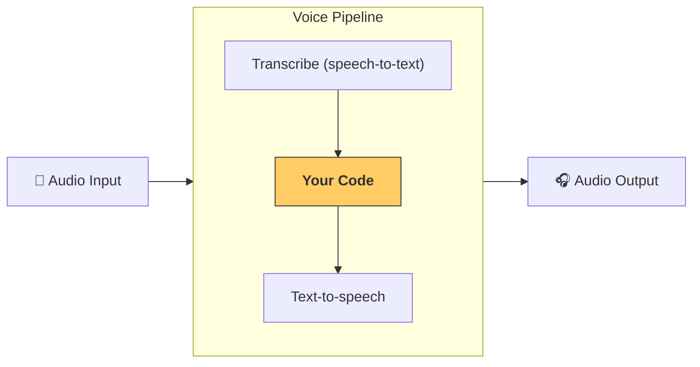

---
search:
  exclude: true
---
# パイプラインとワークフロー

[`VoicePipeline`][agents.voice.pipeline.VoicePipeline] は、エージェント主導のワークフローを音声アプリに変換しやすくするクラスです。実行するワークフローを渡すと、入力音声の文字起こし、音声の終了検知、適切なタイミングでのワークフロー呼び出し、そしてワークフロー出力の音声化までをパイプラインが処理します。



## パイプラインの設定

パイプラインの作成時に、次の項目を設定できます。

1. 毎回新しい音声が書き起こされるたびに実行されるコードである [`workflow`][agents.voice.workflow.VoiceWorkflowBase]
2. 使用する [`speech-to-text`][agents.voice.model.STTModel] と [`text-to-speech`][agents.voice.model.TTSModel] のモデル
3. 次のような設定を行える [`config`][agents.voice.pipeline_config.VoicePipelineConfig]
    - モデル名をモデルにマッピングできるモデルプロバイダー
    - トレーシング（トレーシングの無効化可否、音声ファイルのアップロード有無、ワークフロー名、trace ID など）
    - プロンプト、言語、使用するデータ型など、TTS および STT モデルの設定

## パイプラインの実行

パイプラインは、音声入力を 2 つの形式で渡せる [`run()`][agents.voice.pipeline.VoicePipeline.run] メソッドで実行できます。

1. [`AudioInput`][agents.voice.input.AudioInput] は、完全な音声書き起こしがあり、その結果だけを生成したい場合に使用します。これは、話者の発話終了を検知する必要がないケース、たとえば事前録音の音声や、ユーザーの発話終了が明確なプッシュトゥトーク アプリで有用です。
2. [`StreamedAudioInput`][agents.voice.input.StreamedAudioInput] は、ユーザーの発話終了を検知する必要がある場合に使用します。検知された音声チャンクを逐次プッシュでき、音声パイプラインは「アクティビティ検出」と呼ばれるプロセスによって、適切なタイミングでエージェントのワークフローを自動実行します。

## 結果

音声パイプラインの実行結果は [`StreamedAudioResult`][agents.voice.result.StreamedAudioResult] です。これは、発生したイベントを随時ストリーミングできるオブジェクトです。いくつかの種類の [`VoiceStreamEvent`][agents.voice.events.VoiceStreamEvent] があり、次を含みます。

1. 音声チャンクを含む [`VoiceStreamEventAudio`][agents.voice.events.VoiceStreamEventAudio]
2. ターンの開始や終了などのライフサイクルイベントを通知する [`VoiceStreamEventLifecycle`][agents.voice.events.VoiceStreamEventLifecycle]
3. エラーイベントである [`VoiceStreamEventError`][agents.voice.events.VoiceStreamEventError]

```python

result = await pipeline.run(input)

async for event in result.stream():
    if event.type == "voice_stream_event_audio":
        # play audio
    elif event.type == "voice_stream_event_lifecycle":
        # lifecycle
    elif event.type == "voice_stream_event_error"
        # error
    ...
```

## ベストプラクティス

### 割り込み

現在、Agents SDK は [`StreamedAudioInput`][agents.voice.input.StreamedAudioInput] に対する組み込みの割り込み対応をサポートしていません。代わりに、検出された各ターンごとにワークフローの個別の実行をトリガーします。アプリ内で割り込みを扱いたい場合は、[`VoiceStreamEventLifecycle`][agents.voice.events.VoiceStreamEventLifecycle] イベントをリッスンしてください。`turn_started` は新しいターンが書き起こされ処理が開始したことを示し、`turn_ended` は該当ターンの音声がすべて送出された後に発火します。これらのイベントを用いて、モデルがターンを開始したときに話者のマイクをミュートし、そのターンに関連する音声をすべて送出し終えた後にミュート解除できます。