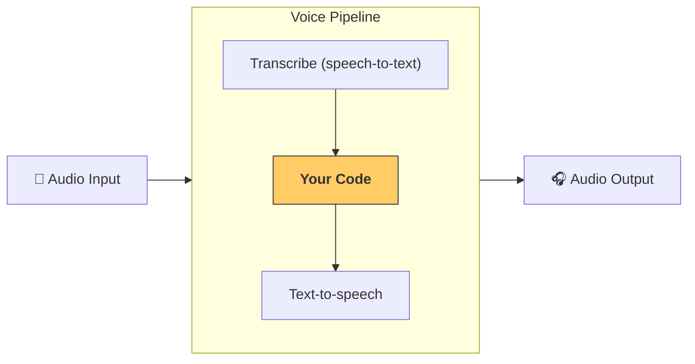

---
search:
  exclude: true
---
# パイプラインとワークフロー

[`VoicePipeline`][agents.voice.pipeline.VoicePipeline] は、エージェント指向のワークフローを音声アプリに簡単に変換できるクラスです。実行するワークフローを渡すと、パイプラインが入力音声の文字起こし、音声の終了検出、適切なタイミングでのワークフロー呼び出し、そしてワークフロー出力の音声への変換まで面倒を見ます。



## パイプラインの設定

パイプライン作成時に、次の項目を設定できます。

1. [`workflow`][agents.voice.workflow.VoiceWorkflowBase]: 新しい音声が文字起こしされるたびに実行されるコードです。
2. 使用する [`speech-to-text`][agents.voice.model.STTModel] と [`text-to-speech`][agents.voice.model.TTSModel] のモデル
3. [`config`][agents.voice.pipeline_config.VoicePipelineConfig]: 次のような項目を設定できます。
    - モデルプロバイダー。モデル名をモデルにマッピングできます
    - トレーシング（トレーシングの無効化可否、音声ファイルのアップロード可否、ワークフロー名、トレース ID など）
    - TTS と STT モデルの設定（プロンプト、言語、使用するデータ型 など）

## パイプラインの実行

パイプラインは [`run()`][agents.voice.pipeline.VoicePipeline.run] メソッドで実行でき、音声入力を次の 2 つの形式で渡せます。

1. [`AudioInput`][agents.voice.input.AudioInput]: 完全な音声トランスクリプトがあり、その結果だけを生成したい場合に使用します。これは、話者の発話終了を検出する必要がないケース（たとえば、事前録音の音声や、ユーザーの発話終了が明確な push-to-talk のアプリ）で有用です。
2. [`StreamedAudioInput`][agents.voice.input.StreamedAudioInput]: ユーザーの発話終了を検出する必要がある場合に使用します。検出した音声チャンクを順次プッシュでき、音声パイプラインが「アクティビティ検出」(activity detection) により適切なタイミングでエージェントのワークフローを自動実行します。

## 結果

音声パイプラインの実行結果は [`StreamedAudioResult`][agents.voice.result.StreamedAudioResult] です。これは、イベントの発生に合わせてストリーミングできるオブジェクトです。[`VoiceStreamEvent`][agents.voice.events.VoiceStreamEvent] にはいくつかの種類があり、次が含まれます。

1. [`VoiceStreamEventAudio`][agents.voice.events.VoiceStreamEventAudio]: 音声チャンクを含みます。
2. [`VoiceStreamEventLifecycle`][agents.voice.events.VoiceStreamEventLifecycle]: ターンの開始・終了などのライフサイクルイベントを通知します。
3. [`VoiceStreamEventError`][agents.voice.events.VoiceStreamEventError]: エラーイベントです。

```python

result = await pipeline.run(input)

async for event in result.stream():
    if event.type == "voice_stream_event_audio":
        # play audio
    elif event.type == "voice_stream_event_lifecycle":
        # lifecycle
    elif event.type == "voice_stream_event_error"
        # error
    ...
```

## ベストプラクティス

### 割り込み

現在、 Agents SDK には [`StreamedAudioInput`][agents.voice.input.StreamedAudioInput] に対する組み込みの割り込みサポートはありません。代わりに、検出された各ターンごとにワークフローの個別の実行をトリガーします。アプリケーション内で割り込みを扱いたい場合は、[`VoiceStreamEventLifecycle`][agents.voice.events.VoiceStreamEventLifecycle] のイベントを監視できます。`turn_started` は新しいターンが文字起こしされて処理が開始されたことを示します。`turn_ended` は該当ターンの音声がすべて送出された後に発火します。これらのイベントを使って、モデルがターンを開始したときに話者のマイクをミュートし、そのターンに関連する音声をすべてフラッシュした後にミュートを解除する、といった制御ができます。