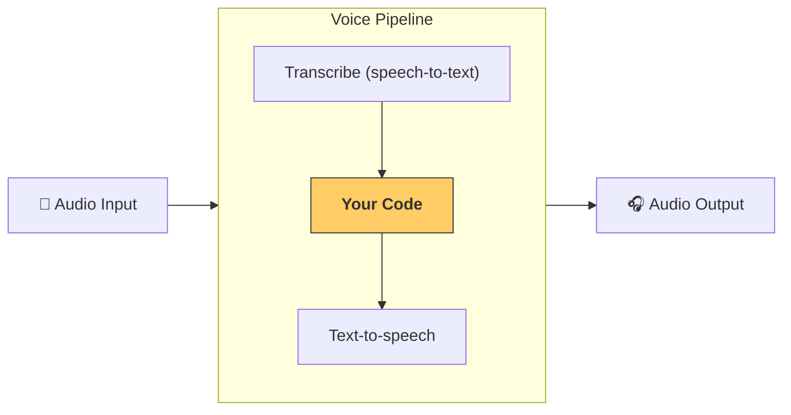

---
search:
  exclude: true
---
# パイプラインとワークフロー

[`VoicePipeline`][agents.voice.pipeline.VoicePipeline] は、エージェントのワークフローを音声アプリに容易に変換できるクラスです。実行するワークフローを渡すと、パイプラインが入力音声の文字起こし、音声終了の検出、適切なタイミングでのワークフロー呼び出し、そしてワークフローの出力を音声に戻す処理を行います。



## パイプラインの設定

パイプラインを作成する際に、次の項目を設定できます。

1. [`workflow`][agents.voice.workflow.VoiceWorkflowBase]：新しい音声が文字起こしされるたびに実行されるコード
2. 使用する [`speech-to-text`][agents.voice.model.STTModel] および [`text-to-speech`][agents.voice.model.TTSModel] のモデル
3. [`config`][agents.voice.pipeline_config.VoicePipelineConfig]：次のような項目を設定できます
    - モデル名をモデルにマッピングできるモデ​​ルプロバイダー
    - トレーシング（トレーシングを無効にするか、音声ファイルをアップロードするか、ワークフロー名、トレース ID など）
    - プロンプト、言語、使用するデータ型など、TTS と STT モデルの設定

## パイプラインの実行

パイプラインは [`run()`][agents.voice.pipeline.VoicePipeline.run] メソッドで実行でき、音声入力は次の 2 つの形式で渡せます。

1. [`AudioInput`][agents.voice.input.AudioInput] は、完結した音声区間があり、その結果だけを生成したい場合に使用します。たとえば、事前録音の音声や、話し終わりが明確なプッシュトゥトークのアプリなど、話者の発話終了を検出する必要がないケースに有用です。
2. [`StreamedAudioInput`][agents.voice.input.StreamedAudioInput] は、ユーザーの話し終わりを検出する必要がある場合に使用します。検出された音声チャンクを順次プッシュでき、パイプラインは「アクティビティ検知」によって適切なタイミングで自動的にエージェントのワークフローを実行します。

## 結果

音声パイプラインの実行結果は [`StreamedAudioResult`][agents.voice.result.StreamedAudioResult] です。これは、発生したイベントをストリーミングで受け取れるオブジェクトです。[`VoiceStreamEvent`][agents.voice.events.VoiceStreamEvent] にはいくつかの種類があり、次のようなものがあります。

1. [`VoiceStreamEventAudio`][agents.voice.events.VoiceStreamEventAudio]：音声チャンクを含みます。
2. [`VoiceStreamEventLifecycle`][agents.voice.events.VoiceStreamEventLifecycle]：ターンの開始や終了などのライフサイクルイベントを通知します。
3. [`VoiceStreamEventError`][agents.voice.events.VoiceStreamEventError]：エラーイベントです。

```python

result = await pipeline.run(input)

async for event in result.stream():
    if event.type == "voice_stream_event_audio":
        # play audio
    elif event.type == "voice_stream_event_lifecycle":
        # lifecycle
    elif event.type == "voice_stream_event_error"
        # error
    ...
```

## ベストプラクティス

### 割り込み

Agents SDK は現在、[`StreamedAudioInput`][agents.voice.input.StreamedAudioInput] に対する組み込みの割り込みサポートを提供していません。代わりに、検出された各ターンごとに、ワークフローの個別の実行をトリガーします。アプリケーション内で割り込みを扱いたい場合は、[`VoiceStreamEventLifecycle`][agents.voice.events.VoiceStreamEventLifecycle] イベントをリッスンしてください。`turn_started` は新しいターンが文字起こしされ処理が開始されたことを示します。`turn_ended` は該当するターンの音声がすべてディスパッチされた後に発火します。これらのイベントを用いて、モデルがターンを開始したときに話者のマイクをミュートし、ターンに関連する音声をすべてフラッシュし終えた後にミュートを解除する、といった制御が可能です。