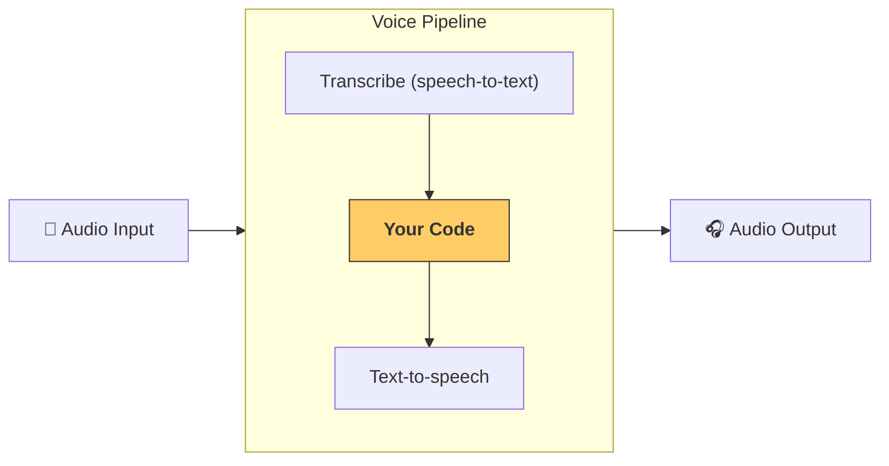

---
search:
  exclude: true
---
# パイプラインとワークフロー

[`VoicePipeline`][agents.voice.pipeline.VoicePipeline] は、エージェントのワークフローを音声アプリに簡単に変換できるクラスです。実行するワークフローを渡すと、パイプラインが入力音声の文字起こし、音声の終了検出、適切なタイミングでのワークフロー呼び出し、そしてワークフローの出力を再び音声に変換する処理を行います。



## パイプラインの設定

パイプライン作成時には、次の項目を設定できます。

1. 新しい音声が文字起こしされるたびに実行されるコードである [`workflow`][agents.voice.workflow.VoiceWorkflowBase]
2. 使用する [`speech-to-text`][agents.voice.model.STTModel] と [`text-to-speech`][agents.voice.model.TTSModel] のモデル
3. 次のような設定を可能にする [`config`][agents.voice.pipeline_config.VoicePipelineConfig]
    - モデル名をモデルにマッピングできるモデルプロバイダー
    - トレーシング（トレーシングの無効化可否、音声ファイルのアップロード可否、ワークフロー名、trace ID など）
    - プロンプト、言語、使用するデータ型など、 TTS と STT モデルの設定

## パイプラインの実行

[`run()`][agents.voice.pipeline.VoicePipeline.run] メソッドでパイプラインを実行できます。音声入力は次の 2 つの形式で渡せます。

1. [`AudioInput`][agents.voice.input.AudioInput] は、完全な音声トランスクリプトがあり、その結果だけを生成したい場合に使用します。これは、話者の発話終了を検出する必要がないケース、たとえば事前録音の音声や、ユーザーが話し終えるタイミングが明確なプッシュトゥトークのアプリで便利です。
2. [`StreamedAudioInput`][agents.voice.input.StreamedAudioInput] は、ユーザーの発話終了を検出する必要がある場合に使用します。検出された音声チャンクをプッシュでき、音声パイプラインは「アクティビティ検出」と呼ばれる処理によって、適切なタイミングで自動的にエージェントのワークフローを実行します。

## 結果

音声パイプライン実行の結果は [`StreamedAudioResult`][agents.voice.result.StreamedAudioResult] です。これは、発生したイベントをストリーミングできるオブジェクトです。いくつかの種類の [`VoiceStreamEvent`][agents.voice.events.VoiceStreamEvent] があり、次を含みます。

1. 音声チャンクを含む [`VoiceStreamEventAudio`][agents.voice.events.VoiceStreamEventAudio]
2. ターンの開始や終了といったライフサイクルイベントを通知する [`VoiceStreamEventLifecycle`][agents.voice.events.VoiceStreamEventLifecycle]
3. エラーイベントである [`VoiceStreamEventError`][agents.voice.events.VoiceStreamEventError]

```python

result = await pipeline.run(input)

async for event in result.stream():
    if event.type == "voice_stream_event_audio":
        # play audio
    elif event.type == "voice_stream_event_lifecycle":
        # lifecycle
    elif event.type == "voice_stream_event_error"
        # error
    ...
```

## ベストプラクティス

### 割り込み

Agents SDK は現在、[`StreamedAudioInput`][agents.voice.input.StreamedAudioInput] に対する組み込みの割り込みサポートを提供していません。代わりに、検出された各ターンごとにワークフローの個別の実行をトリガーします。アプリケーション内で割り込みに対応したい場合は、[`VoiceStreamEventLifecycle`][agents.voice.events.VoiceStreamEventLifecycle] イベントを監視できます。`turn_started` は新しいターンが文字起こしされ、処理が開始されたことを示します。`turn_ended` は対応するターンの音声がすべて送出された後にトリガーされます。これらのイベントを使用して、モデルがターンを開始したときに話者のマイクをミュートし、ターンに関連する音声をすべて送出し終えた後にミュート解除することができます。