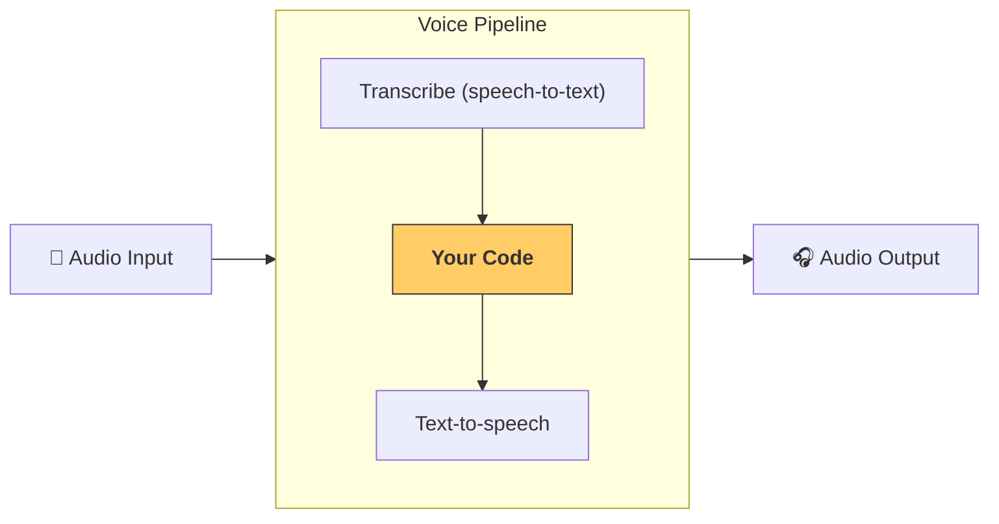

---
search:
  exclude: true
---
# パイプラインとワークフロー

[`VoicePipeline`][agents.voice.pipeline.VoicePipeline] クラスを使用すると、 エージェント ワークフローを簡単に音声アプリへ変換できます。実行したいワークフローを渡すだけで、パイプラインが入力音声の文字起こし、音声終了の検知、適切なタイミングでのワークフロー呼び出し、そしてワークフロー出力を音声へ戻す処理を自動で行います。



## パイプラインの設定

パイプラインを作成するとき、以下の項目を設定できます:

1. [`workflow`][agents.voice.workflow.VoiceWorkflowBase]  
   新しい音声が文字起こしされるたびに実行されるコードです。  
2. [`speech-to-text`][agents.voice.model.STTModel] と [`text-to-speech`][agents.voice.model.TTSModel] モデル  
3. [`config`][agents.voice.pipeline_config.VoicePipelineConfig]  
   次のような設定を行えます:  
   - モデルプロバイダー: モデル名をモデルにマッピングします  
   - トレーシング: トレーシングの有効 / 無効、音声ファイルのアップロード有無、ワークフロー名、トレース ID など  
   - TTS と STT モデルの設定: プロンプト、言語、データ型 など

## パイプラインの実行

パイプラインは [`run()`][agents.voice.pipeline.VoicePipeline.run] メソッドで実行できます。音声入力は 2 つの形式で渡せます:

1. [`AudioInput`][agents.voice.input.AudioInput]  
   完全な音声トランスクリプトがある場合に使用し、そのトランスクリプトに対する結果だけを生成します。あらかじめ録音された音声や push-to-talk アプリのように話し終わりが明確なケースで便利です。  
2. [`StreamedAudioInput`][agents.voice.input.StreamedAudioInput]  
   ユーザーが話し終えたかどうかを検知する必要がある場合に使用します。音声チャンクを検出次第プッシュでき、パイプラインが「アクティビティ検知」により適切なタイミングでワークフローを実行します。

## 結果

音声パイプラインの実行結果は [`StreamedAudioResult`][agents.voice.result.StreamedAudioResult] です。このオブジェクトを通じてイベントをストリーミングで受け取れます。主な [`VoiceStreamEvent`][agents.voice.events.VoiceStreamEvent] は次のとおりです:

1. [`VoiceStreamEventAudio`][agents.voice.events.VoiceStreamEventAudio]  
   音声チャンクを含みます。  
2. [`VoiceStreamEventLifecycle`][agents.voice.events.VoiceStreamEventLifecycle]  
   ターンの開始や終了など、ライフサイクルイベントを通知します。  
3. [`VoiceStreamEventError`][agents.voice.events.VoiceStreamEventError]  
   エラーイベントです。

```python

result = await pipeline.run(input)

async for event in result.stream():
    if event.type == "voice_stream_event_audio":
        # play audio
    elif event.type == "voice_stream_event_lifecycle":
        # lifecycle
    elif event.type == "voice_stream_event_error"
        # error
    ...
```

## ベストプラクティス

### 割り込み

Agents SDK は現在、[`StreamedAudioInput`][agents.voice.input.StreamedAudioInput] に対して組み込みの割り込み機能を提供していません。検知された各ターンごとにワークフローが個別に実行されます。アプリ内で割り込みを処理したい場合は、[`VoiceStreamEventLifecycle`][agents.voice.events.VoiceStreamEventLifecycle] イベントを監視してください。`turn_started` は新しいターンが文字起こしされ処理が始まったことを示し、`turn_ended` はそのターンに関連する音声がすべて送信された後に発火します。モデルがターンを開始した際にマイクをミュートし、ターン関連の音声をすべて送信し終えた後でアンミュートする、といった制御にこれらのイベントを利用できます。