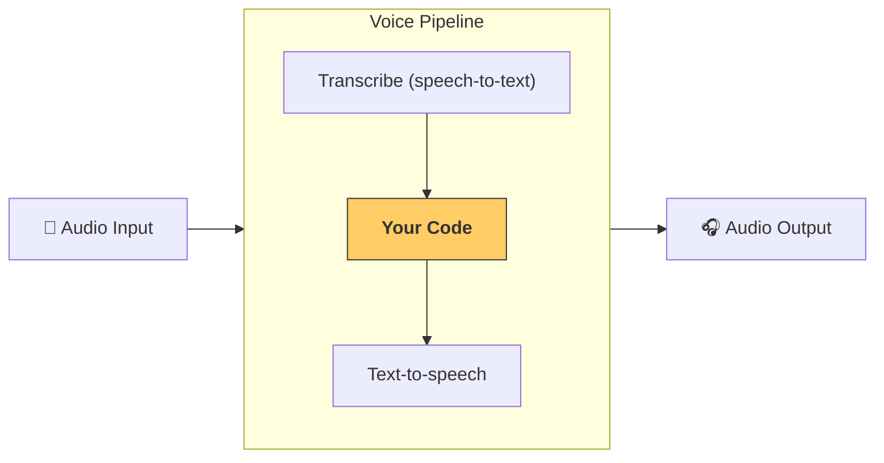

---
search:
  exclude: true
---
# パイプラインとワークフロー

[`agents.voice.pipeline.VoicePipeline`](agents.voice.pipeline.VoicePipeline) は、エージェント型のワークフローを音声アプリに変換しやすくするクラスです。実行するワークフローを渡すと、パイプラインが入力音声の文字起こし、音声の終了検出、適切なタイミングでのワークフロー呼び出し、そしてワークフロー出力を音声に戻す処理までを引き受けます。



## パイプラインの設定

パイプラインを作成するとき、次の項目を設定できます。

1. [`agents.voice.workflow.VoiceWorkflowBase`](agents.voice.workflow.VoiceWorkflowBase) の `workflow`。新しい音声が文字起こしされるたびに実行されるコードです。
2. 使用する [`agents.voice.model.STTModel`](agents.voice.model.STTModel)（speech-to-text）と [`agents.voice.model.TTSModel`](agents.voice.model.TTSModel)（text-to-speech）のモデル
3. [`agents.voice.pipeline_config.VoicePipelineConfig`](agents.voice.pipeline_config.VoicePipelineConfig) の `config`。次のような設定ができます:
    - モデルプロバイダー（モデル名をモデルへマッピングできます）
    - トレーシング（無効化の可否、音声ファイルのアップロード可否、ワークフロー名、トレース ID など）
    - TTS と STT のモデル設定（プロンプト、言語、使用するデータ型など）

## パイプラインの実行

パイプラインは [`agents.voice.pipeline.VoicePipeline.run`](agents.voice.pipeline.VoicePipeline.run) の `run()` メソッドで実行できます。音声入力は次の 2 つの形式で渡せます。

1. [`agents.voice.input.AudioInput`](agents.voice.input.AudioInput) は、完全な音声を書き起こしたテキストがあり、その結果だけを生成したい場合に使います。話者が話し終えるタイミングを検出する必要がないケース、例えばあらかじめ録音された音声や、ユーザーが話し終えるタイミングが明確なプッシュ・トゥ・トークのアプリで有用です。
2. [`agents.voice.input.StreamedAudioInput`](agents.voice.input.StreamedAudioInput) は、ユーザーが話し終えたタイミングを検出する必要がある場合に使います。検出された音声チャンクをプッシュでき、音声パイプラインは「アクティビティ検出」によって適切なタイミングで自動的にエージェントのワークフローを実行します。

## 実行結果

音声パイプライン実行の結果は [`agents.voice.result.StreamedAudioResult`](agents.voice.result.StreamedAudioResult) です。これは、発生するイベントを逐次ストリーミングできるオブジェクトです。いくつかの種類の [`agents.voice.events.VoiceStreamEvent`](agents.voice.events.VoiceStreamEvent) があります。

1. [`agents.voice.events.VoiceStreamEventAudio`](agents.voice.events.VoiceStreamEventAudio): 音声チャンクを含みます。
2. [`agents.voice.events.VoiceStreamEventLifecycle`](agents.voice.events.VoiceStreamEventLifecycle): ターンの開始・終了などのライフサイクルイベントを通知します。
3. [`agents.voice.events.VoiceStreamEventError`](agents.voice.events.VoiceStreamEventError): エラーイベントです。

```python

result = await pipeline.run(input)

async for event in result.stream():
    if event.type == "voice_stream_event_audio":
        # play audio
    elif event.type == "voice_stream_event_lifecycle":
        # lifecycle
    elif event.type == "voice_stream_event_error"
        # error
    ...
```

## ベストプラクティス

### 割り込み

Agents SDK は現在、[`agents.voice.input.StreamedAudioInput`](agents.voice.input.StreamedAudioInput) に対する割り込みの組み込みサポートを提供していません。代わりに、検出された各ターンごとに、ワークフローの個別の実行がトリガーされます。アプリケーション内で割り込みを扱いたい場合は、[`agents.voice.events.VoiceStreamEventLifecycle`](agents.voice.events.VoiceStreamEventLifecycle) のイベントを監視してください。`turn_started` は新しいターンが文字起こしされ処理が開始されたことを示し、`turn_ended` は該当ターンのすべての音声が配信された後に発火します。これらのイベントを利用して、モデルがターンを開始したときに話者のマイクをミュートし、そのターンに関連する音声をすべてフラッシュした後にアンミュートすることができます。