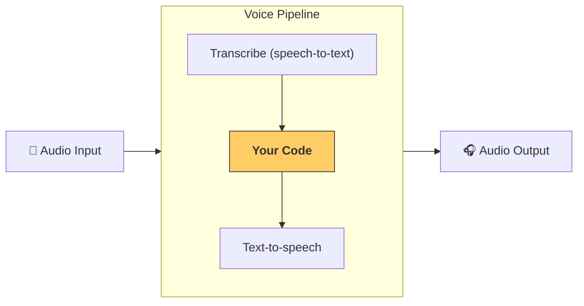

---
search:
  exclude: true
---
# パイプラインとワークフロー

[`VoicePipeline`][agents.voice.pipeline.VoicePipeline] は、エージェント のワークフローを音声アプリに簡単に変換できるクラスです。実行したいワークフローを渡すと、パイプラインが入力音声の文字起こし、音声の終了検出、適切なタイミングでのワークフロー呼び出し、そしてワークフロー出力の音声への変換までを処理します。



## パイプラインの構成

パイプラインを作成するとき、次の設定ができます。

1. 毎回新しい音声が文字起こしされるたびに実行されるコードである [`workflow`][agents.voice.workflow.VoiceWorkflowBase]
2. 使用する [`speech-to-text`][agents.voice.model.STTModel] および [`text-to-speech`][agents.voice.model.TTSModel] のモデル
3. 次のような項目を構成できる [`config`][agents.voice.pipeline_config.VoicePipelineConfig]
    - モデル名をモデルに対応付けできるモデルプロバイダー
    - トレーシング（トレーシングの無効化、音声ファイルのアップロード可否、ワークフロー名、トレース ID など）
    - プロンプト、言語、使用するデータ型など TTS と STT モデルの設定

## パイプラインの実行

パイプラインは [`run()`][agents.voice.pipeline.VoicePipeline.run] メソッドで実行でき、音声入力を次の 2 つの形式で渡せます。

1. [`AudioInput`][agents.voice.input.AudioInput] は完全な音声トランスクリプトがある場合に使用し、その結果を生成するだけでよいときに使います。これは、話者の発話終了を検出する必要がないケース、たとえば録音済み音声や、 ユーザー の発話終了が明確なプッシュ・トゥ・トークのアプリで有用です。
2. [`StreamedAudioInput`][agents.voice.input.StreamedAudioInput] は、 ユーザー の発話終了を検出する必要がある場合に使用します。検出された音声チャンクを順次プッシュでき、ボイスパイプラインは「activity detection（アクティビティ検出）」と呼ばれるプロセスを通じて適切なタイミングでエージェント のワークフローを自動実行します。

## 結果

ボイスパイプライン実行の結果は [`StreamedAudioResult`][agents.voice.result.StreamedAudioResult] です。これは、発生するイベントを逐次 ストリーミング できるオブジェクトです。いくつかの種類の [`VoiceStreamEvent`][agents.voice.events.VoiceStreamEvent] があり、次が含まれます。

1. 音声チャンクを含む [`VoiceStreamEventAudio`][agents.voice.events.VoiceStreamEventAudio]
2. ターンの開始・終了などのライフサイクルイベントを知らせる [`VoiceStreamEventLifecycle`][agents.voice.events.VoiceStreamEventLifecycle]
3. エラーイベントである [`VoiceStreamEventError`][agents.voice.events.VoiceStreamEventError]

```python

result = await pipeline.run(input)

async for event in result.stream():
    if event.type == "voice_stream_event_audio":
        # play audio
    elif event.type == "voice_stream_event_lifecycle":
        # lifecycle
    elif event.type == "voice_stream_event_error"
        # error
    ...
```

## ベストプラクティス

### 割り込み

Agents SDK は現時点では [`StreamedAudioInput`][agents.voice.input.StreamedAudioInput] に対する組み込みの割り込みサポートを提供していません。代わりに、検出された各ターンごとにワークフローの個別の実行をトリガーします。アプリケーション内で割り込みを扱いたい場合は、[`VoiceStreamEventLifecycle`][agents.voice.events.VoiceStreamEventLifecycle] イベントを購読してください。`turn_started` は新しいターンが文字起こしされ処理が始まったことを示します。`turn_ended` は該当ターンのすべての音声が送出された後に発火します。これらのイベントを使って、モデルがターンを開始したときに話者のマイクをミュートし、ターンに関連する音声をすべてフラッシュした後にミュートを解除するといった制御ができます。