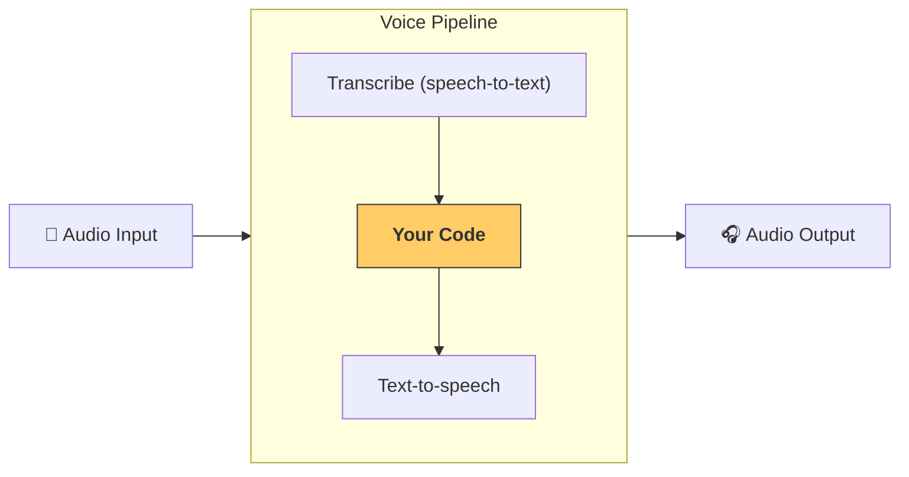

---
search:
  exclude: true
---
# パイプラインとワークフロー

[VoicePipeline クラス][agents.voice.pipeline.VoicePipeline] は、エージェントベースのワークフローを音声アプリに簡単に変換するためのクラスです。実行したいワークフローを渡すと、パイプラインが入力音声の文字起こし、音声終了の検出、適切なタイミングでのワークフロー呼び出し、そしてワークフロー出力の音声化までを処理します。



## パイプラインの設定

パイプラインを作成する際に、次の項目を設定できます:

1. 新しい音声が文字起こしされるたびに実行されるコードである [workflow][agents.voice.workflow.VoiceWorkflowBase]
2. 使用する [speech-to-text モデル][agents.voice.model.STTModel] と [text-to-speech モデル][agents.voice.model.TTSModel]
3. 次のような項目を設定できる [config][agents.voice.pipeline_config.VoicePipelineConfig]
    - モデル名をモデルにマッピングできるモデルプロバイダー
    - トレーシング（トレーシングの無効化、音声ファイルのアップロード可否、ワークフロー名、トレース ID など）
    - TTS と STT モデルの設定（プロンプト、言語、使用するデータ型 など）

## パイプラインの実行

パイプラインは [`run()`][agents.voice.pipeline.VoicePipeline.run] メソッドで実行でき、音声入力を次の 2 つの形式で渡せます:

1. [AudioInput][agents.voice.input.AudioInput] は、完全な音声があり、その結果だけを生成したいときに使用します。発話終了の検出が不要なケース、たとえば録音済み音声や、ユーザーの発話終了が明確なプッシュ・トゥ・トーク型アプリで便利です。
2. [StreamedAudioInput][agents.voice.input.StreamedAudioInput] は、ユーザーの発話終了を検出する必要がある場合に使用します。検出された音声チャンクをプッシュでき、パイプラインは「アクティビティ検知（音声アクティビティ検知）」により適切なタイミングで自動的にエージェントのワークフローを実行します。

## 結果

音声パイプライン実行の結果は [StreamedAudioResult][agents.voice.result.StreamedAudioResult] です。これは発生するイベントを逐次ストリーミングできるオブジェクトです。いくつかの種類の [VoiceStreamEvent][agents.voice.events.VoiceStreamEvent] があり、含まれるものは次のとおりです:

1. 音声チャンクを含む [VoiceStreamEventAudio][agents.voice.events.VoiceStreamEventAudio]
2. ターンの開始や終了などのライフサイクルイベントを通知する [VoiceStreamEventLifecycle][agents.voice.events.VoiceStreamEventLifecycle]
3. エラーイベントである [VoiceStreamEventError][agents.voice.events.VoiceStreamEventError]

```python

result = await pipeline.run(input)

async for event in result.stream():
    if event.type == "voice_stream_event_audio":
        # play audio
    elif event.type == "voice_stream_event_lifecycle":
        # lifecycle
    elif event.type == "voice_stream_event_error"
        # error
    ...
```

## ベストプラクティス

### 割り込み

Agents SDK は現在、[StreamedAudioInput][agents.voice.input.StreamedAudioInput] に対する組み込みの割り込みサポートを提供していません。代わりに、検出された各ターンごとにワークフローの個別の実行をトリガーします。アプリケーション内で割り込みを扱いたい場合は、[VoiceStreamEventLifecycle][agents.voice.events.VoiceStreamEventLifecycle] イベントを購読してください。`turn_started` は新しいターンが文字起こしされ処理が開始されたことを示します。`turn_ended` は該当ターンの音声がすべて送出された後に発火します。モデルがターンを開始したら話者のマイクをミュートし、そのターンに関連する音声の送出をすべて終えたらミュートを解除する、といった制御にこれらのイベントを活用できます。