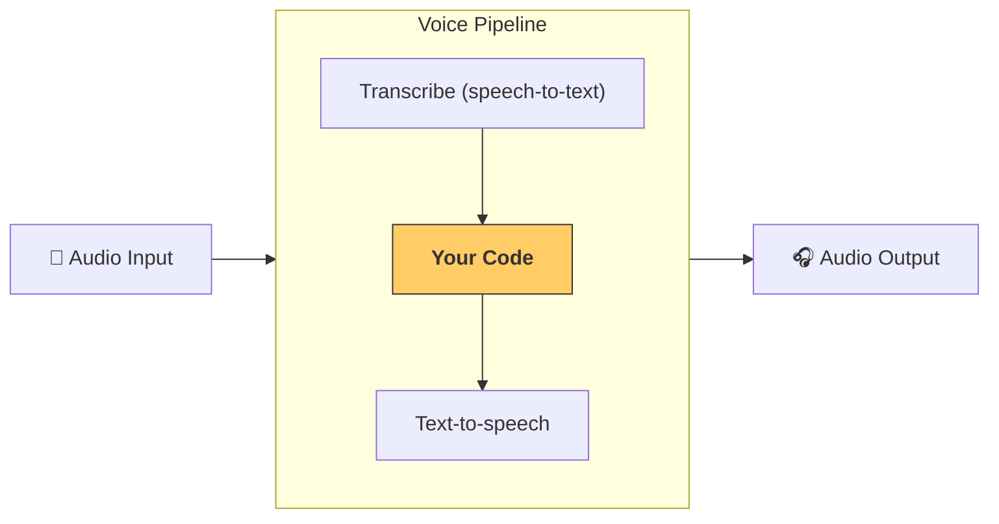

---
search:
  exclude: true
---
# パイプラインとワークフロー

[`VoicePipeline`][agents.voice.pipeline.VoicePipeline] は、エージェント的なワークフローを音声アプリへ簡単に変換できるクラスです。ワークフローを渡すだけで、入力音声の文字起こし、音声終了の検知、適切なタイミングでのワークフロー呼び出し、そしてワークフロー出力を音声へ変換する処理までをパイプラインが自動で処理します。



## パイプラインの設定

パイプラインを作成する際には、以下を設定できます。

1. [`workflow`][agents.voice.workflow.VoiceWorkflowBase]  
   新しい音声が文字起こしされるたびに実行されるコードです。  
2. 使用する [`speech-to-text`][agents.voice.model.STTModel] および [`text-to-speech`][agents.voice.model.TTSModel] モデル  
3. [`config`][agents.voice.pipeline_config.VoicePipelineConfig]  
   次のような項目を設定できます。  
    - モデルプロバイダー：モデル名をモデルにマッピングします  
    - トレーシング：トレーシングの有効 / 無効、音声ファイルのアップロード有無、ワークフロー名、トレース ID など  
    - TTS・STT モデルの設定：プロンプト、言語、データタイプなど  

## パイプラインの実行

パイプラインは [`run()`][agents.voice.pipeline.VoicePipeline.run] メソッドで実行できます。音声入力は 2 つの形式で渡せます。

1. [`AudioInput`][agents.voice.input.AudioInput]  
   完全な音声が既にあり、その文字起こしに対して結果を生成したい場合に使用します。例えば、事前録音音声やプッシュトゥトークで発話終了が明確なアプリで便利です。  
2. [`StreamedAudioInput`][agents.voice.input.StreamedAudioInput]  
   ユーザーの発話終了を検知する必要がある場合に使用します。音声チャンクを順次送信でき、パイプラインがアクティビティ検知を通じて適切なタイミングでエージェントワークフローを実行します。  

## 結果

音声パイプラインの実行結果は [`StreamedAudioResult`][agents.voice.result.StreamedAudioResult] です。これはイベントをストリーミングで受け取れるオブジェクトで、以下のような [`VoiceStreamEvent`][agents.voice.events.VoiceStreamEvent] が存在します。

1. [`VoiceStreamEventAudio`][agents.voice.events.VoiceStreamEventAudio]  
   音声チャンクを含みます。  
2. [`VoiceStreamEventLifecycle`][agents.voice.events.VoiceStreamEventLifecycle]  
   ターンの開始・終了などライフサイクルイベントを通知します。  
3. [`VoiceStreamEventError`][agents.voice.events.VoiceStreamEventError]  
   エラーイベントです。  

```python

result = await pipeline.run(input)

async for event in result.stream():
    if event.type == "voice_stream_event_audio":
        # play audio
    elif event.type == "voice_stream_event_lifecycle":
        # lifecycle
    elif event.type == "voice_stream_event_error"
        # error
    ...
```

## ベストプラクティス

### 割り込み

Agents SDK は現時点で [`StreamedAudioInput`][agents.voice.input.StreamedAudioInput] に対する組み込みの割り込み処理をサポートしていません。検知された各ターンごとに個別にワークフローが実行されます。アプリケーション側で割り込みを処理したい場合は、[`VoiceStreamEventLifecycle`][agents.voice.events.VoiceStreamEventLifecycle] を監視してください。  
- `turn_started` は新しいターンが文字起こしされ、処理が開始されたことを示します。  
- `turn_ended` は該当ターンの音声がすべて送信された後に発火します。  

モデルがターンを開始したときにマイクをミュートし、ターンに関連する音声をすべて送信し終えた後にアンミュートする、といった制御をこれらのイベントで実装できます。