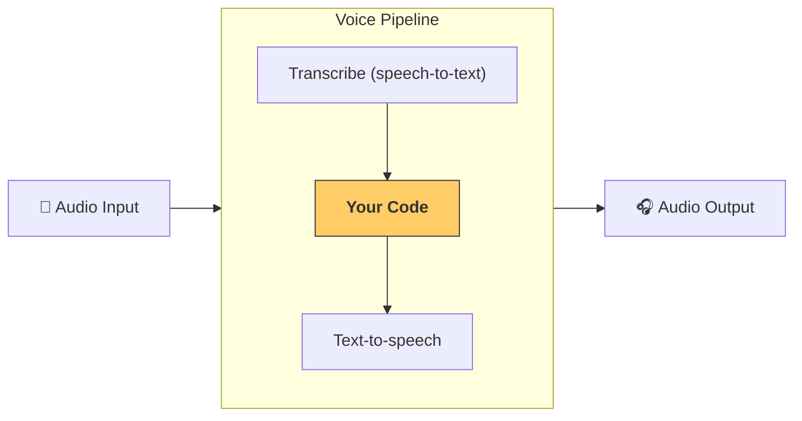

---
search:
  exclude: true
---
# パイプラインとワークフロー

[`VoicePipeline`][agents.voice.pipeline.VoicePipeline] は、エージェント型ワークフローを音声アプリに変換するのを容易にするクラスです。実行したいワークフローを渡すと、パイプラインが入力音声の文字起こし、音声終了の検出、適切なタイミングでのワークフロー呼び出し、そしてワークフロー出力を音声に戻す処理までを担当します。



## パイプラインの設定

パイプライン作成時には、次の項目を設定できます。

1. 新しい音声が文字起こしされるたびに実行されるコードである [`workflow`][agents.voice.workflow.VoiceWorkflowBase]
2. 使用する [`speech-to-text`][agents.voice.model.STTModel] と [`text-to-speech`][agents.voice.model.TTSModel] のモデル
3. 次のような内容を設定できる [`config`][agents.voice.pipeline_config.VoicePipelineConfig]
    - モデル名をモデルにマッピングできるモデルプロバイダー
    - トレーシング（トレーシングの無効化、音声ファイルのアップロード可否、ワークフロー名、トレース ID など）
    - TTS と STT モデルの設定（プロンプト、言語、使用するデータ型など）

## パイプラインの実行

パイプラインは [`run()`][agents.voice.pipeline.VoicePipeline.run] メソッドで実行でき、音声入力を 2 つの形式で渡せます。

1. [`AudioInput`][agents.voice.input.AudioInput] は完全な音声書き起こしがあり、その結果だけを生成したい場合に使います。話者の発話終了を検出する必要がないケース、たとえば録音済み音声や、ユーザーの発話終了が明確なプッシュトゥトークのアプリで有用です。
2. [`StreamedAudioInput`][agents.voice.input.StreamedAudioInput] は、ユーザーの発話終了を検出する必要がある場合に使います。検出され次第、音声チャンクを逐次プッシュでき、パイプラインは「アクティビティ検出」と呼ばれる処理により、適切なタイミングで自動的にエージェントのワークフローを実行します。

## 結果

音声パイプラインの実行結果は [`StreamedAudioResult`][agents.voice.result.StreamedAudioResult] です。これは、発生するイベントをストリーミングで受け取れるオブジェクトです。いくつかの種類の [`VoiceStreamEvent`][agents.voice.events.VoiceStreamEvent] があり、次を含みます。

1. 音声チャンクを含む [`VoiceStreamEventAudio`][agents.voice.events.VoiceStreamEventAudio]
2. ターンの開始や終了などのライフサイクルイベントを通知する [`VoiceStreamEventLifecycle`][agents.voice.events.VoiceStreamEventLifecycle]
3. エラーイベントである [`VoiceStreamEventError`][agents.voice.events.VoiceStreamEventError]

```python

result = await pipeline.run(input)

async for event in result.stream():
    if event.type == "voice_stream_event_audio":
        # play audio
    elif event.type == "voice_stream_event_lifecycle":
        # lifecycle
    elif event.type == "voice_stream_event_error"
        # error
    ...
```

## ベストプラクティス

### 割り込み

Agents SDK は現在、[`StreamedAudioInput`][agents.voice.input.StreamedAudioInput] に対する組み込みの割り込み機能をサポートしていません。検出された各ターンに対して、ワークフローの個別の実行がトリガーされます。アプリケーション内で割り込みを扱いたい場合は、[`VoiceStreamEventLifecycle`][agents.voice.events.VoiceStreamEventLifecycle] イベントを監視してください。`turn_started` は新しいターンが書き起こされ処理が開始されたことを示し、`turn_ended` は該当ターンの音声がすべて送出された後に発火します。これらのイベントを用いて、モデルがターンを開始したときに話者のマイクをミュートし、そのターンに関連する音声の送出が完了したらミュート解除するといった制御ができます。