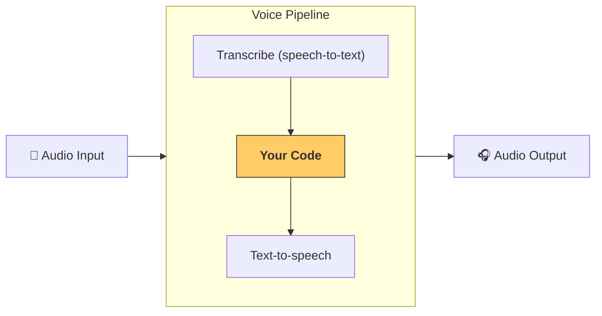

---
search:
  exclude: true
---
# パイプラインとワークフロー

[`VoicePipeline`][agents.voice.pipeline.VoicePipeline] は、エージェント ワークフローを音声アプリに変換しやすくするクラスです。実行するワークフローを渡すと、パイプラインが入力音声の文字起こし、音声終了の検出、適切なタイミングでのワークフロー呼び出し、そしてワークフロー出力の音声への変換までを処理します。



## パイプラインの設定

パイプライン作成時には、次の項目を設定できます:

1. 新しい音声が文字起こしされるたびに実行されるコードである [`workflow`][agents.voice.workflow.VoiceWorkflowBase]
2. 使用する [`speech-to-text`][agents.voice.model.STTModel] と [`text-to-speech`][agents.voice.model.TTSModel] の各モデル
3. 次のような設定を行える [`config`][agents.voice.pipeline_config.VoicePipelineConfig]
    - モデル名をモデルにマッピングできるモデルプロバイダー
    - トレーシング（トレーシングの無効化、音声ファイルのアップロード可否、ワークフロー名、トレース ID など）
    - プロンプト、言語、使用するデータ型など TTS と STT モデルの設定

## パイプラインの実行

パイプラインは [`run()`][agents.voice.pipeline.VoicePipeline.run] メソッドで実行できます。音声入力は次の 2 つの形式を渡せます:

1. [`AudioInput`][agents.voice.input.AudioInput] は、完全な音声の録音があり、その結果だけを生成したいときに使用します。話者が話し終えたタイミングの検出が不要なケース、たとえば事前録音の音声や、ユーザーが話し終えるタイミングが明確なプッシュ・トゥ・トークのアプリで便利です。
2. [`StreamedAudioInput`][agents.voice.input.StreamedAudioInput] は、ユーザーが話し終えたタイミングの検出が必要な場合に使用します。検出された音声チャンクを随時プッシュでき、音声パイプラインは「アクティビティ検出」と呼ばれるプロセスで適切なタイミングにエージェント ワークフローを自動実行します。

## 結果

音声パイプライン実行の結果は [`StreamedAudioResult`][agents.voice.result.StreamedAudioResult] です。これは、発生したイベントをストリーミングで受け取れるオブジェクトです。いくつかの種類の [`VoiceStreamEvent`][agents.voice.events.VoiceStreamEvent] があり、次が含まれます:

1. 音声チャンクを含む [`VoiceStreamEventAudio`][agents.voice.events.VoiceStreamEventAudio]
2. ターンの開始や終了などライフサイクルイベントを通知する [`VoiceStreamEventLifecycle`][agents.voice.events.VoiceStreamEventLifecycle]
3. エラーイベントである [`VoiceStreamEventError`][agents.voice.events.VoiceStreamEventError]

```python

result = await pipeline.run(input)

async for event in result.stream():
    if event.type == "voice_stream_event_audio":
        # play audio
    elif event.type == "voice_stream_event_lifecycle":
        # lifecycle
    elif event.type == "voice_stream_event_error"
        # error
    ...
```

## ベストプラクティス

### 割り込み

OpenAI Agents SDK は現時点で、[`StreamedAudioInput`][agents.voice.input.StreamedAudioInput] に対する組み込みの割り込みサポートを提供していません。代わりに、検出された各ターンごとに、ワークフローの個別の実行がトリガーされます。アプリケーション内で割り込みを扱いたい場合は、[`VoiceStreamEventLifecycle`][agents.voice.events.VoiceStreamEventLifecycle] イベントを監視してください。`turn_started` は新しいターンが文字起こしされ処理が開始されたことを示します。`turn_ended` は該当ターンのすべての音声が送出された後にトリガーされます。モデルがターンを開始した際に話者のマイクをミュートし、ターンに関連する音声の送出が完了した後にミュート解除する、といった制御にこれらのイベントを利用できます。