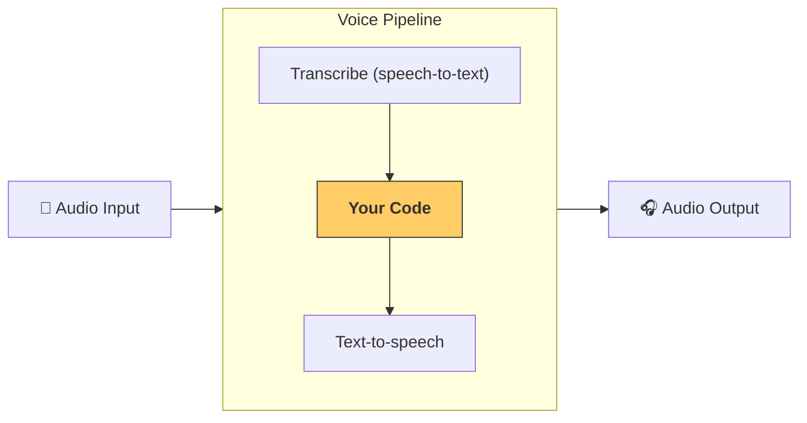

---
search:
  exclude: true
---
# パイプラインとワークフロー

[`VoicePipeline`][agents.voice.pipeline.VoicePipeline] は、エージェント型ワークフローを音声アプリに変換しやすくするクラスです。実行したいワークフローを渡すと、パイプラインが入力音声の文字起こし、音声終了の検出、適切なタイミングでのワークフロー呼び出し、そしてワークフロー出力の音声化までを処理します。



## パイプラインの設定

パイプラインを作成するとき、次の項目を設定できます。

1. [`workflow`][agents.voice.workflow.VoiceWorkflowBase]: 新しい音声が文字起こしされるたびに実行されるコード
2. 使用する [`speech-to-text`][agents.voice.model.STTModel] と [`text-to-speech`][agents.voice.model.TTSModel] のモデル
3. [`config`][agents.voice.pipeline_config.VoicePipelineConfig]: 次のような項目を設定できます
    - モデルプロバイダー（モデル名をモデルにマッピング）
    - トレーシング（トレーシングの無効化、音声ファイルのアップロード可否、ワークフロー名、トレース ID など）
    - TTS と STT モデルの設定（プロンプト、言語、使用するデータ型など）

## パイプラインの実行

パイプラインは [`run()`][agents.voice.pipeline.VoicePipeline.run] メソッドで実行でき、音声入力を 2 つの形式で渡せます。

1. [`AudioInput`][agents.voice.input.AudioInput]: 完全な音声全体の文字起こしがあり、その結果を生成したい場合に使用します。話者が話し終えたタイミングの検出が不要なケースに有用です（例: 事前録音の音声、ユーザーが話し終えたことが明確なプッシュ・トゥ・トークのアプリなど）。
2. [`StreamedAudioInput`][agents.voice.input.StreamedAudioInput]: ユーザーが話し終えたタイミングの検出が必要な場合に使用します。検出された音声チャンクを順次プッシュでき、パイプラインは「アクティビティ検出 (activity detection)」というプロセスにより、適切なタイミングでエージェントのワークフローを自動実行します。

## 結果

音声パイプライン実行の結果は [`StreamedAudioResult`][agents.voice.result.StreamedAudioResult] です。これは、発生するイベントをストリーミングできるオブジェクトです。いくつかの種類の [`VoiceStreamEvent`][agents.voice.events.VoiceStreamEvent] があり、次を含みます。

1. [`VoiceStreamEventAudio`][agents.voice.events.VoiceStreamEventAudio]: 音声チャンクを含みます。
2. [`VoiceStreamEventLifecycle`][agents.voice.events.VoiceStreamEventLifecycle]: ターンの開始・終了などのライフサイクルイベントを通知します。
3. [`VoiceStreamEventError`][agents.voice.events.VoiceStreamEventError]: エラーイベントです。

```python

result = await pipeline.run(input)

async for event in result.stream():
    if event.type == "voice_stream_event_audio":
        # play audio
    elif event.type == "voice_stream_event_lifecycle":
        # lifecycle
    elif event.type == "voice_stream_event_error"
        # error
    ...
```

## ベストプラクティス

### 割り込み

Agents SDK は現在、[`StreamedAudioInput`][agents.voice.input.StreamedAudioInput] に対する組み込みの割り込みサポートを提供していません。代わりに、検出された各ターンごとにワークフローの個別の実行がトリガーされます。アプリケーション内で割り込みを処理したい場合は、[`VoiceStreamEventLifecycle`][agents.voice.events.VoiceStreamEventLifecycle] イベントを購読してください。`turn_started` は新しいターンが文字起こしされ処理が開始されたことを示し、`turn_ended` は該当ターンのすべての音声が送出された後にトリガーされます。これらのイベントを使用して、モデルがターンを開始したときに話者のマイクをミュートし、そのターンに関連する音声をすべてフラッシュした後にアンミュートすることができます。