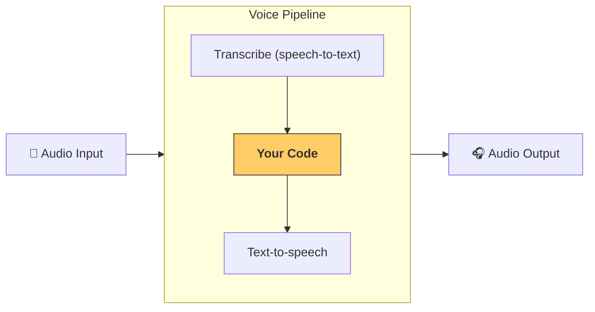

---
search:
  exclude: true
---
# パイプラインとワークフロー

[`VoicePipeline`][agents.voice.pipeline.VoicePipeline] は、エージェントのワークフローを音声アプリへ簡単に変換できるクラスです。実行したいワークフローを渡すだけで、入力音声の文字起こし、音声終了の検出、適切なタイミングでのワークフロー呼び出し、そしてワークフロー出力を再び音声へ変換する処理をパイプラインが自動で行います。



## パイプラインの構成

パイプラインを作成する際には、次の項目を設定できます。

1. [`workflow`][agents.voice.workflow.VoiceWorkflowBase]  
   新しい音声が書き起こされるたびに実行されるコードです。  
2. 使用する [`speech-to-text`][agents.voice.model.STTModel] と [`text-to-speech`][agents.voice.model.TTSModel] のモデル  
3. [`config`][agents.voice.pipeline_config.VoicePipelineConfig]  
   - モデル名をモデルにマッピングするモデルプロバイダー  
   - トレーシング（トレーシングを無効にするか、音声ファイルをアップロードするか、ワークフロー名、トレース ID など）  
   - プロンプト、言語、使用するデータ型など、TTS と STT モデルに関する設定  

## パイプラインの実行

パイプラインは [`run()`][agents.voice.pipeline.VoicePipeline.run] メソッドで実行できます。音声入力は次の 2 つの形式で渡せます。

1. [`AudioInput`][agents.voice.input.AudioInput]  
   完全な音声の書き起こしがあり、その結果だけが必要な場合に使用します。話者がいつ話し終えたかを検出する必要がない、事前録音の音声やプッシュ・トゥ・トーク形式のアプリなどで便利です。  
2. [`StreamedAudioInput`][agents.voice.input.StreamedAudioInput]  
   ユーザーが話し終えたタイミングを検出する必要がある場合に使用します。検出された音声チャンクを逐次プッシュでき、パイプラインが「アクティビティ検出」と呼ばれる処理で適切なタイミングにワークフローを自動実行します。  

## 結果

音声パイプライン実行の結果は [`StreamedAudioResult`][agents.voice.result.StreamedAudioResult] です。これはイベントを逐次ストリーミングできるオブジェクトで、いくつかの [`VoiceStreamEvent`][agents.voice.events.VoiceStreamEvent] が含まれます。

1. [`VoiceStreamEventAudio`][agents.voice.events.VoiceStreamEventAudio] — 音声チャンクを含みます。  
2. [`VoiceStreamEventLifecycle`][agents.voice.events.VoiceStreamEventLifecycle] — ターン開始・終了などのライフサイクルイベントを通知します。  
3. [`VoiceStreamEventError`][agents.voice.events.VoiceStreamEventError] — エラーイベントです。  

```python

result = await pipeline.run(input)

async for event in result.stream():
    if event.type == "voice_stream_event_audio":
        # play audio
    elif event.type == "voice_stream_event_lifecycle":
        # lifecycle
    elif event.type == "voice_stream_event_error"
        # error
    ...
```

## ベストプラクティス

### 割り込み

Agents SDK には現在、[`StreamedAudioInput`][agents.voice.input.StreamedAudioInput] に対する組み込みの割り込み処理はありません。そのため、検出された各ターンごとにワークフローが個別に実行されます。アプリケーション内で割り込みを処理したい場合は [`VoiceStreamEventLifecycle`][agents.voice.events.VoiceStreamEventLifecycle] イベントを監視してください。  
`turn_started` は新しいターンが書き起こされ処理が開始されたことを示し、`turn_ended` は該当ターンの音声がすべてディスパッチされた後に発火します。これらのイベントを利用して、モデルがターンを開始したときに話者のマイクをミュートし、そのターンに関連する音声をすべて送信し終えた後にアンミュートするといった制御が可能です。