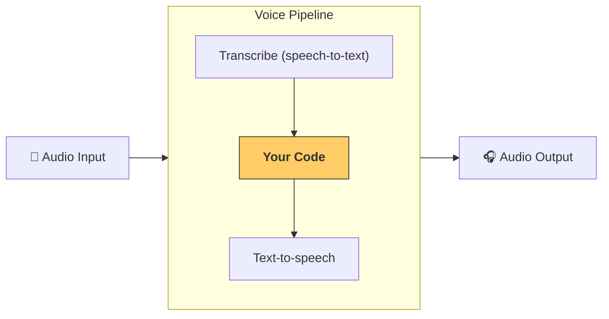

---
search:
  exclude: true
---
# パイプラインとワークフロー

`VoicePipeline` は、エージェントベースのワークフローを音声アプリに簡単に変換できるクラスです。実行したいワークフローを渡すと、パイプラインが入力音声の文字起こし、発話終了の検知、適切なタイミングでのワークフロー呼び出し、そしてワークフローの出力を音声へ変換する処理を自動で行います。



## パイプラインの設定

パイプラインを作成する際には、次の項目を設定できます。

1. `workflow` — 新しい音声が文字起こしされるたびに実行されるコードです。
2. `speech-to-text` および `text-to-speech` モデル
3. `config` — 以下のような設定を行えます。
   - モデルプロバイダー：モデル名を実際のモデルにマッピングします
   - トレーシング：トレーシングの有効／無効、音声ファイルのアップロード可否、ワークフロー名、トレース ID など
   - TTS と STT モデルの設定：プロンプト、言語、データ型 など

## パイプラインの実行

パイプラインは `run()` メソッドで実行できます。音声入力は次の 2 つの形式で渡せます。

1. `AudioInput` — 完全な音声トランスクリプトがある場合に使用します。発話の終了検知が不要なケース、たとえば事前録音済みの音声や push-to-talk アプリのようにユーザーの発話終了が明確な場合に便利です。
2. `StreamedAudioInput` — ユーザーの発話終了を検知する必要がある場合に使用します。音声チャンクをリアルタイムでプッシュでき、パイプラインが自動でアクティビティ検知を行い、適切なタイミングでエージェントワークフローを実行します。

## 結果

音声パイプラインの実行結果は `StreamedAudioResult` です。このオブジェクトを通じて、発生するイベントをストリーミング形式で受け取れます。`VoiceStreamEvent` には次の種類があります。

1. `VoiceStreamEventAudio` — 音声チャンクを含みます。
2. `VoiceStreamEventLifecycle` — ターンの開始や終了などライフサイクルイベントを通知します。
3. `VoiceStreamEventError` — エラーイベントです。

```python

result = await pipeline.run(input)

async for event in result.stream():
    if event.type == "voice_stream_event_audio":
        # play audio
    elif event.type == "voice_stream_event_lifecycle":
        # lifecycle
    elif event.type == "voice_stream_event_error"
        # error
    ...
```

## ベストプラクティス

### 割り込み

Agents SDK には `StreamedAudioInput` に対する組み込みの割り込み機能はまだありません。そのため、検知された各ターンごとにワークフローが個別に実行されます。アプリケーション内で割り込みを扱いたい場合は、`VoiceStreamEventLifecycle` をリッスンしてください。`turn_started` は新しいターンが文字起こしされ、処理が開始されたことを示します。`turn_ended` は該当ターンの音声がすべて送出された後に発火します。モデルがターンを開始した際にマイクをミュートし、ターンに関連する音声をすべて送信し終えたらアンミュートする、といった制御にこれらのイベントを利用できます。