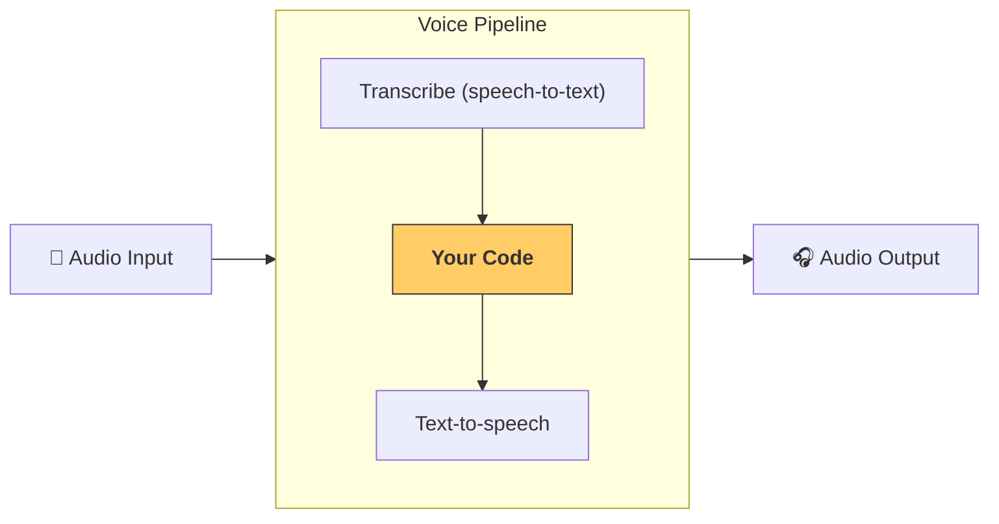

---
search:
  exclude: true
---
# パイプラインとワークフロー

[`VoicePipeline`][agents.voice.pipeline.VoicePipeline] は、エージェント ベースのワークフローを音声アプリへ簡単に変換できるクラスです。実行したいワークフローを渡すだけで、パイプラインが入力音声の書き起こし、音声終了の検出、適切なタイミングでのワークフロー呼び出し、そしてワークフロー出力を再び音声へ変換する処理を自動で行います。



## パイプラインの設定

パイプラインを作成する際には、次の項目を設定できます。

1. [`workflow`][agents.voice.workflow.VoiceWorkflowBase]  
   新しい音声が書き起こされるたびに実行されるコードです。  
2. [`speech-to-text`][agents.voice.model.STTModel] と [`text-to-speech`][agents.voice.model.TTSModel] の各モデル  
3. [`config`][agents.voice.pipeline_config.VoicePipelineConfig]  
   次のような内容を設定できます。  
   - モデル名をモデルにマッピングするモデルプロバイダー  
   - トレーシングの有効／無効、音声ファイルのアップロード有無、ワークフロー名、トレース ID など  
   - TTS・STT モデルのプロンプト、言語、データ型などの設定

## パイプラインの実行

パイプラインは [`run()`][agents.voice.pipeline.VoicePipeline.run] メソッドで実行できます。音声入力は 2 通りの形式で渡せます。

1. [`AudioInput`][agents.voice.input.AudioInput]  
   完全な音声の書き起こしがある場合に使用します。話者がいつ話し終えたかを検出する必要がない、たとえば事前録音された音声やプッシュトゥトーク アプリなどに適しています。  
2. [`StreamedAudioInput`][agents.voice.input.StreamedAudioInput]  
   話者が話し終えたタイミングを検出する必要がある場合に使用します。検出された音声チャンクを順次プッシュでき、パイプラインが「アクティビティ検出」と呼ばれる処理を通じて適切なタイミングでエージェント ワークフローを自動実行します。

## 実行結果

音声パイプライン実行の結果は [`StreamedAudioResult`][agents.voice.result.StreamedAudioResult] オブジェクトです。これは発生するイベントをストリーミングで受け取れるオブジェクトで、いくつかの [`VoiceStreamEvent`][agents.voice.events.VoiceStreamEvent] 種類があります。

1. [`VoiceStreamEventAudio`][agents.voice.events.VoiceStreamEventAudio]  
   音声チャンクを含むイベント  
2. [`VoiceStreamEventLifecycle`][agents.voice.events.VoiceStreamEventLifecycle]  
   ターン開始・終了などのライフサイクル イベントを知らせるイベント  
3. [`VoiceStreamEventError`][agents.voice.events.VoiceStreamEventError]  
   エラー イベント  

```python

result = await pipeline.run(input)

async for event in result.stream():
    if event.type == "voice_stream_event_audio":
        # play audio
    elif event.type == "voice_stream_event_lifecycle":
        # lifecycle
    elif event.type == "voice_stream_event_error"
        # error
    ...
```

## ベストプラクティス

### 割り込み処理

現在、 Agents SDK には [`StreamedAudioInput`][agents.voice.input.StreamedAudioInput] に対する組み込みの割り込み処理機能はありません。検出された各ターンごとに、別々にワークフローが実行されます。アプリ内で割り込みを扱いたい場合は、[`VoiceStreamEventLifecycle`][agents.voice.events.VoiceStreamEventLifecycle] イベントを監視してください。`turn_started` は新しいターンが書き起こされ、処理が開始されたことを示します。`turn_ended` は対応するターンの音声がすべて送信された後に発火します。モデルがターンを開始したときにマイクをミュートし、関連する音声をすべて送信し終えたらアンミュートする、といった制御をこれらのイベントで行えます。