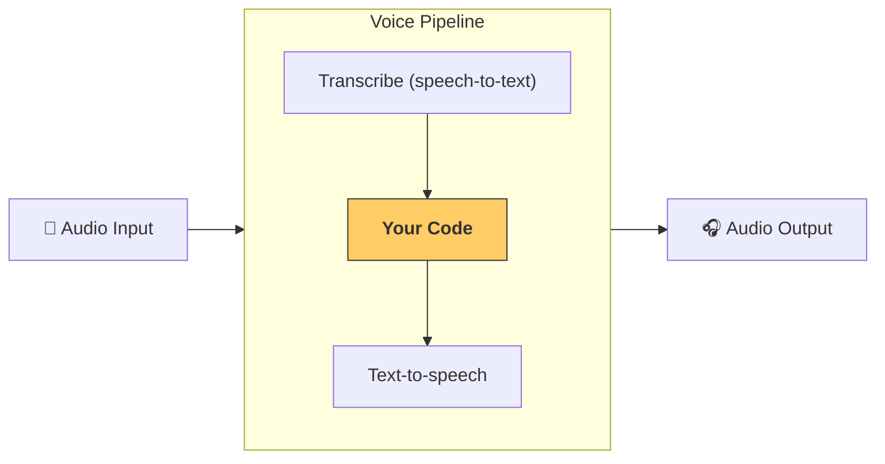

---
search:
  exclude: true
---
# パイプラインとワークフロー

[`VoicePipeline`][agents.voice.pipeline.VoicePipeline] は、エージェント指向のワークフローを音声アプリへ簡単に変換できるクラスです。実行したいワークフローを渡すだけで、パイプラインが入力音声の文字起こし、音声終了の検出、適切なタイミングでのワークフロー呼び出し、そしてワークフローの出力を再び音声へ変換する処理を自動で行います。



## パイプラインの設定

パイプラインを作成する際に次の項目を設定できます。

1. [`workflow`][agents.voice.workflow.VoiceWorkflowBase] — 新しい音声が文字起こしされるたびに実行されるコード
2. 使用する [`speech-to-text`][agents.voice.model.STTModel] モデルと [`text-to-speech`][agents.voice.model.TTSModel] モデル
3. [`config`][agents.voice.pipeline_config.VoicePipelineConfig] — 以下を設定できます  
    - モデルプロバイダー (モデル名をモデルにマッピング)  
    - トレーシング (トレーシングの有効 / 無効、音声ファイルのアップロード有無、ワークフロー名、トレース ID など)  
    - TTS および STT モデルのプロンプト、言語、データタイプなどの設定

## パイプラインの実行

パイプラインは [`run()`][agents.voice.pipeline.VoicePipeline.run] メソッドで実行できます。音声入力は 2 つの形式で渡せます。

1. [`AudioInput`][agents.voice.input.AudioInput] — 完全な音声トランスクリプトが既にあり、その結果だけを得たい場合に使用します。たとえば録音済み音声や、ユーザーが話し終えるタイミングが明確なプッシュ・トゥー・トーク型アプリで便利です。  
2. [`StreamedAudioInput`][agents.voice.input.StreamedAudioInput] — ユーザーが話し終えたタイミングを検出する必要がある場合に使用します。音声チャンクを検出次第プッシュでき、ボイスパイプラインが「アクティビティ検出」と呼ばれる処理を通じて適切なタイミングでエージェント ワークフローを自動実行します。

## 結果

ボイスパイプライン実行の結果は [`StreamedAudioResult`][agents.voice.result.StreamedAudioResult] です。このオブジェクトにより、発生するイベントをストリーム形式で受け取れます。イベントにはいくつかの [`VoiceStreamEvent`][agents.voice.events.VoiceStreamEvent] があり、例として以下があります。

1. [`VoiceStreamEventAudio`][agents.voice.events.VoiceStreamEventAudio] — 音声チャンクを含みます。  
2. [`VoiceStreamEventLifecycle`][agents.voice.events.VoiceStreamEventLifecycle] — ターンの開始・終了などライフサイクルイベントを通知します。  
3. [`VoiceStreamEventError`][agents.voice.events.VoiceStreamEventError] — エラーイベントです。

```python

result = await pipeline.run(input)

async for event in result.stream():
    if event.type == "voice_stream_event_audio":
        # play audio
    elif event.type == "voice_stream_event_lifecycle":
        # lifecycle
    elif event.type == "voice_stream_event_error"
        # error
    ...
```

## ベストプラクティス

### 割り込み

Agents SDK は現在 [`StreamedAudioInput`][agents.voice.input.StreamedAudioInput] に対して組み込みの割り込みサポートを提供していません。そのため検出された各ターンごとにワークフローが個別に実行されます。アプリケーション内で割り込みを処理したい場合は [`VoiceStreamEventLifecycle`][agents.voice.events.VoiceStreamEventLifecycle] イベントをリッスンしてください。`turn_started` は新しいターンが文字起こしされ、処理が開始されたことを示します。`turn_ended` は該当ターンのすべての音声がディスパッチされた後に発火します。モデルがターンを開始した際にマイクをミュートし、ターン関連の音声をすべて送信し終えた後にアンミュートする、といった処理をこれらのイベントで行えます。