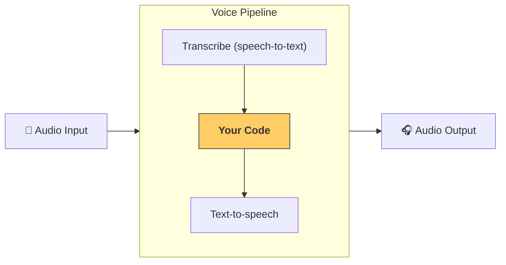

---
search:
  exclude: true
---
# パイプラインとワークフロー

[`VoicePipeline`][agents.voice.pipeline.VoicePipeline] は、エージェント型ワークフローを音声アプリに簡単に変換できるクラスです。実行したいワークフローを渡すと、入力音声の文字起こし、音声終了の検出、適切なタイミングでのワークフロー呼び出し、そしてワークフロー出力を音声へ再変換する処理をパイプラインが自動で行います。



## パイプラインの設定

パイプラインを作成するときに、以下の項目を設定できます。

1. [`workflow`][agents.voice.workflow.VoiceWorkflowBase]  
   新しい音声が文字起こしされるたびに実行されるコードです。  
2. [`speech-to-text`][agents.voice.model.STTModel] と [`text-to-speech`][agents.voice.model.TTSModel] の各モデル  
3. [`config`][agents.voice.pipeline_config.VoicePipelineConfig]  
   さまざまな設定が可能です。  
   - モデルプロバイダー：モデル名をモデルにマッピングします。  
   - トレーシング：トレーシングの無効化、音声ファイルのアップロード有無、ワークフロー名、トレース ID などを設定できます。  
   - TTS / STT モデルの設定：プロンプト、言語、データ型などを指定できます。  

## パイプラインの実行

パイプラインは [`run()`][agents.voice.pipeline.VoicePipeline.run] メソッドで実行します。音声入力は次の 2 形式で渡せます。

1. [`AudioInput`][agents.voice.input.AudioInput]  
   完全な音声トランスクリプトがある場合に使用し、その内容に対する結果だけを生成します。録音済み音声や、ユーザーが話し終わるタイミングが明確なプッシュトゥトーク方式のアプリで便利です。  
2. [`StreamedAudioInput`][agents.voice.input.StreamedAudioInput]  
   ユーザーが話し終わるタイミングを検出する必要がある場合に使用します。音声チャンクを順次プッシュでき、パイプラインが「アクティビティ検出」により適切なタイミングでワークフローを自動実行します。  

## 結果

音声パイプライン実行の結果は [`StreamedAudioResult`][agents.voice.result.StreamedAudioResult] です。これは発生したイベントをストリームで受け取れるオブジェクトで、以下のような [`VoiceStreamEvent`][agents.voice.events.VoiceStreamEvent] が含まれます。

1. [`VoiceStreamEventAudio`][agents.voice.events.VoiceStreamEventAudio]  
   音声チャンクを含みます。  
2. [`VoiceStreamEventLifecycle`][agents.voice.events.VoiceStreamEventLifecycle]  
   ターンの開始・終了などライフサイクルイベントを通知します。  
3. [`VoiceStreamEventError`][agents.voice.events.VoiceStreamEventError]  
   エラーイベントです。  

```python

result = await pipeline.run(input)

async for event in result.stream():
    if event.type == "voice_stream_event_audio":
        # play audio
    elif event.type == "voice_stream_event_lifecycle":
        # lifecycle
    elif event.type == "voice_stream_event_error"
        # error
    ...
```

## ベストプラクティス

### 割り込み

Agents SDK は現在、[`StreamedAudioInput`][agents.voice.input.StreamedAudioInput] に対して組み込みの割り込み処理をサポートしていません。検出された各ターンごとにワークフローが個別に実行されます。アプリ内で割り込みを扱いたい場合は、[`VoiceStreamEventLifecycle`][agents.voice.events.VoiceStreamEventLifecycle] イベントを監視してください。`turn_started` は新しいターンが文字起こしされ処理が開始されたことを示し、`turn_ended` はそのターンに関連する音声がすべて送信された後に発火します。モデルがターンを開始したらスピーカーのマイクをミュートし、そのターンの音声をすべて再生し終えたらアンミュートするといった制御に利用できます。