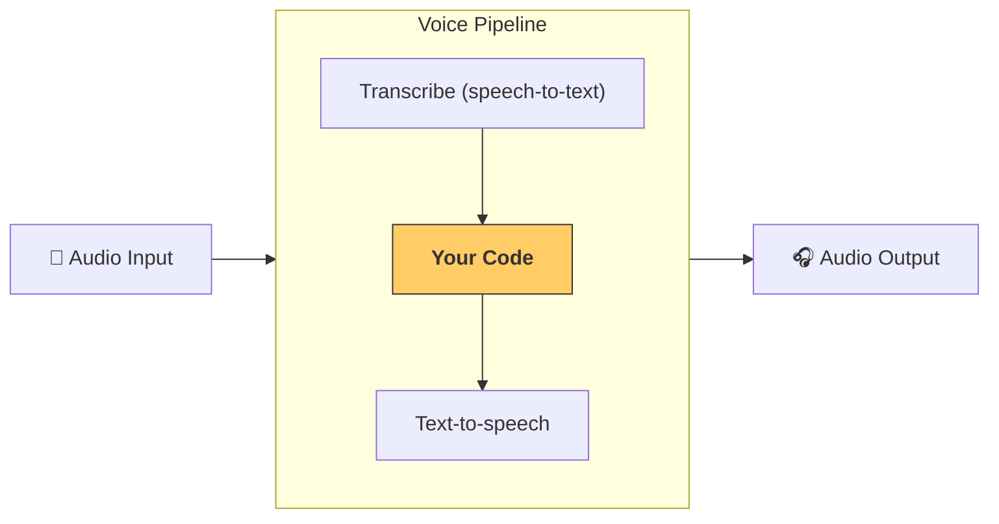

---
search:
  exclude: true
---
# パイプラインとワークフロー

[`VoicePipeline`][agents.voice.pipeline.VoicePipeline] は、エージェント型のワークフローをボイスアプリに簡単に変換できるクラスです。実行したいワークフローを渡すと、パイプラインが入力音声の文字起こし、音声終了の検出、適切なタイミングでのワークフロー呼び出し、そしてワークフロー出力を音声に戻す処理までを行います。



## パイプラインの設定

パイプライン作成時には、次の項目を設定できます。

1. 毎回新しい音声が文字起こしされるたびに実行されるコードである [`workflow`][agents.voice.workflow.VoiceWorkflowBase]
2. 使用する [`speech-to-text`][agents.voice.model.STTModel] と [`text-to-speech`][agents.voice.model.TTSModel] の各モデル
3. 次のような項目を設定できる [`config`][agents.voice.pipeline_config.VoicePipelineConfig]
    - モデル名をモデルにマッピングできるモデルプロバイダー
    - トレーシング（トレーシングの無効化、音声ファイルのアップロード有無、ワークフロー名、トレース ID など）
    - TTS と STT モデルの設定（プロンプト、言語、使用するデータ型など）

## パイプラインの実行

パイプラインは [`run()`][agents.voice.pipeline.VoicePipeline.run] メソッドで実行でき、音声入力を次の 2 つの形式で渡せます。

1. [`AudioInput`][agents.voice.input.AudioInput] は、完全な音声の文字起こしが既にあり、その結果に対する出力だけが必要な場合に使います。話者が話し終えたタイミングの検出が不要なケース、例えば事前録音の音声や、ユーザーが話し終わるタイミングが明確なプッシュトゥトーク型アプリで有用です。
2. [`StreamedAudioInput`][agents.voice.input.StreamedAudioInput] は、ユーザーが話し終えたタイミングの検出が必要な場合に使います。検出された音声チャンクを逐次プッシュでき、パイプラインは「アクティビティ検出」と呼ばれる処理を通じて、適切なタイミングで自動的にエージェントのワークフローを実行します。

## 結果

ボイスパイプライン実行の結果は [`StreamedAudioResult`][agents.voice.result.StreamedAudioResult] です。これはイベントを発生順にストリームできるオブジェクトです。いくつかの種類の [`VoiceStreamEvent`][agents.voice.events.VoiceStreamEvent] があり、次を含みます。

1. 音声チャンクを含む [`VoiceStreamEventAudio`][agents.voice.events.VoiceStreamEventAudio]
2. ターンの開始・終了などライフサイクルイベントを知らせる [`VoiceStreamEventLifecycle`][agents.voice.events.VoiceStreamEventLifecycle]
3. エラーイベントである [`VoiceStreamEventError`][agents.voice.events.VoiceStreamEventError]

```python

result = await pipeline.run(input)

async for event in result.stream():
    if event.type == "voice_stream_event_audio":
        # play audio
    elif event.type == "voice_stream_event_lifecycle":
        # lifecycle
    elif event.type == "voice_stream_event_error"
        # error
    ...
```

## ベストプラクティス

### 割り込み

Agents SDK は現在、[`StreamedAudioInput`][agents.voice.input.StreamedAudioInput] 向けの組み込みの割り込み機能をサポートしていません。代わりに、検出された各ターンごとに、ワークフローが個別に実行されます。アプリケーション内で割り込みを扱いたい場合は、[`VoiceStreamEventLifecycle`][agents.voice.events.VoiceStreamEventLifecycle] イベントを監視してください。`turn_started` は新しいターンが文字起こしされ、処理が始まったことを示します。`turn_ended` は該当ターンの音声がすべてディスパッチされた後に発火します。これらのイベントを利用して、モデルがターンを開始したタイミングで話者のマイクをミュートし、ターンに関連する音声をすべてフラッシュした後にミュートを解除する、といった制御が可能です。