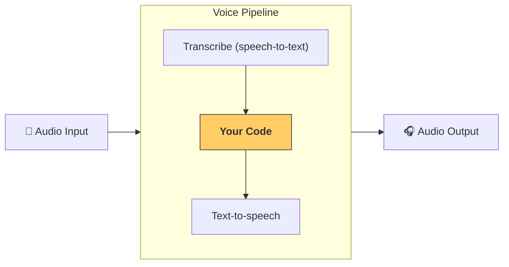

---
search:
  exclude: true
---
# パイプラインとワークフロー

[`VoicePipeline`][agents.voice.pipeline.VoicePipeline] は、エージェント型のワークフローを音声アプリに簡単に変換できるクラスです。実行したいワークフローを渡すと、パイプラインが入力オーディオの文字起こし、音声終了の検出、適切なタイミングでのワークフロー呼び出し、ワークフロー出力の音声化までを処理します。



## パイプラインの設定

パイプライン作成時には、以下を設定できます。

1. 新しい音声が文字起こしされるたびに実行されるコードである [`workflow`][agents.voice.workflow.VoiceWorkflowBase]
2. 使用する [`speech-to-text`][agents.voice.model.STTModel] と [`text-to-speech`][agents.voice.model.TTSModel] のモデル
3. 次のような項目を設定できる [`config`][agents.voice.pipeline_config.VoicePipelineConfig]
    - モデル名をモデルにマッピングできるモデルプロバイダー
    - トレーシング（トレーシングを無効にするか、音声ファイルをアップロードするか、ワークフロー名、トレース ID など）
    - TTS と STT モデルの設定（プロンプト、言語、使用するデータ型など）

## パイプラインの実行

パイプラインは [`run()`][agents.voice.pipeline.VoicePipeline.run] メソッドで実行でき、オーディオ入力を次の 2 つの形式で渡せます。

1. [`AudioInput`][agents.voice.input.AudioInput] は、完全な音声の書き起こしがあり、その結果だけを生成したい場合に使用します。これは、話者が話し終えたタイミングを検出する必要がないケース、たとえば事前録音の音声や、ユーザーが話し終えるタイミングが明確な push-to-talk アプリなどで役立ちます。
2. [`StreamedAudioInput`][agents.voice.input.StreamedAudioInput] は、ユーザーが話し終えたタイミングを検出する必要がある場合に使用します。検出されたオーディオチャンクを逐次プッシュでき、音声パイプラインが "activity detection" と呼ばれる処理を通じて適切なタイミングでエージェント ワークフローを自動的に実行します。

## 結果

音声パイプライン実行の結果は [`StreamedAudioResult`][agents.voice.result.StreamedAudioResult] です。これは、発生するイベントをその場でストリーミングできるオブジェクトです。いくつかの種類の [`VoiceStreamEvent`][agents.voice.events.VoiceStreamEvent] があり、以下を含みます。

1. 音声チャンクを含む [`VoiceStreamEventAudio`][agents.voice.events.VoiceStreamEventAudio]
2. ターンの開始・終了などのライフサイクルイベントを通知する [`VoiceStreamEventLifecycle`][agents.voice.events.VoiceStreamEventLifecycle]
3. エラーイベントである [`VoiceStreamEventError`][agents.voice.events.VoiceStreamEventError]

```python

result = await pipeline.run(input)

async for event in result.stream():
    if event.type == "voice_stream_event_audio":
        # play audio
    elif event.type == "voice_stream_event_lifecycle":
        # lifecycle
    elif event.type == "voice_stream_event_error"
        # error
    ...
```

## ベストプラクティス

### 割り込み

Agents SDK は現時点で [`StreamedAudioInput`][agents.voice.input.StreamedAudioInput] に対する組み込みの割り込みサポートを提供していません。代わりに、検出された各ターンについてワークフローの個別の実行がトリガーされます。アプリケーション内で割り込みを扱いたい場合は、[`VoiceStreamEventLifecycle`][agents.voice.events.VoiceStreamEventLifecycle] イベントを監視してください。`turn_started` は新しいターンが文字起こしされ処理が開始されたことを示し、`turn_ended` は該当ターンの音声がすべて送出された後にトリガーされます。モデルがターンを開始したときに話者のマイクをミュートし、ターンに関連する音声をすべてフラッシュした後にミュート解除する、といった制御にこれらのイベントを利用できます。