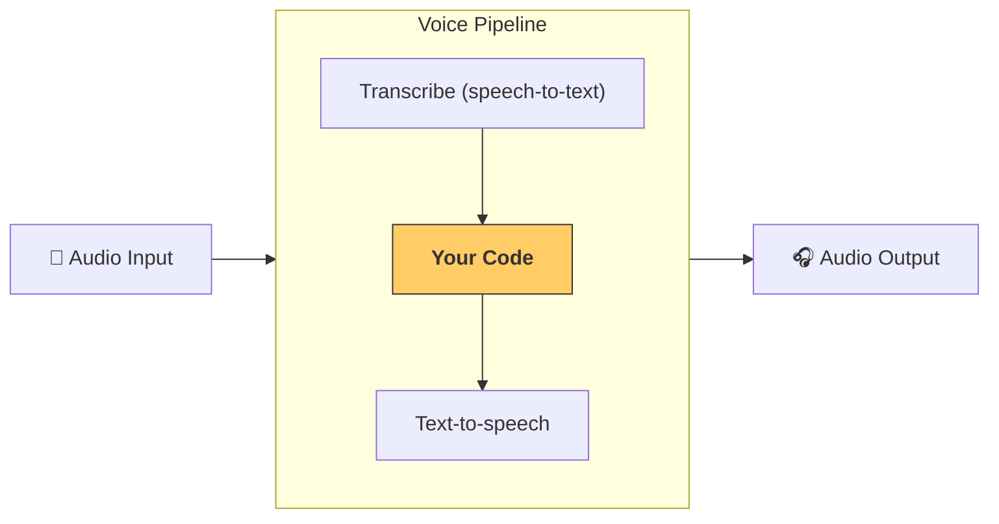

---
search:
  exclude: true
---
# パイプラインとワークフロー

`VoicePipeline` は、エージェントのワークフローを音声アプリへ簡単に変換できるクラスです。ワークフローを渡すだけで、パイプラインが入力音声の文字起こし、音声終了の検出、適切なタイミングでのワークフロー呼び出し、そしてワークフロー出力を音声へ変換する処理を行います。



## パイプラインの設定

パイプラインを作成する際には、次の項目を設定できます:

1. [`workflow`][agents.voice.workflow.VoiceWorkflowBase]  
   新しい音声が文字起こしされるたびに実行されるコードです。
2. [`speech-to-text`][agents.voice.model.STTModel] と [`text-to-speech`][agents.voice.model.TTSModel] モデル  
   音声認識と音声合成に使用するモデルを指定します。
3. [`config`][agents.voice.pipeline_config.VoicePipelineConfig]  
   以下のような設定を行えます:
   - モデルプロバイダー: モデル名をモデルにマッピングします  
   - トレーシング: トレーシングの有効 / 無効、音声ファイルのアップロード可否、ワークフロー名、トレース ID など  
   - TTS / STT モデルの設定: プロンプト、言語、データ型 など

## パイプラインの実行

パイプラインは [`run()`][agents.voice.pipeline.VoicePipeline.run] メソッドで実行できます。音声入力は 2 つの形式で渡せます:

1. [`AudioInput`][agents.voice.input.AudioInput]  
   完全な音声録音がある場合に使用し、その音声に対する結果のみを生成します。録音済み音声やプッシュ・トゥ・トークのように発話終了が明確なアプリで便利です。
2. [`StreamedAudioInput`][agents.voice.input.StreamedAudioInput]  
   発話終了を検出する必要がある場合に使用します。音声チャンクを検出次第プッシュでき、パイプラインが「アクティビティ検出」により適切なタイミングでワークフローを自動実行します。

## 結果

音声パイプラインの実行結果は [`StreamedAudioResult`][agents.voice.result.StreamedAudioResult] です。これは、イベントをストリーミングで受け取れるオブジェクトで、いくつかの [`VoiceStreamEvent`][agents.voice.events.VoiceStreamEvent] が含まれます:

1. [`VoiceStreamEventAudio`][agents.voice.events.VoiceStreamEventAudio] — 音声チャンクを含みます。  
2. [`VoiceStreamEventLifecycle`][agents.voice.events.VoiceStreamEventLifecycle] — ターン開始・終了などのライフサイクルイベントを通知します。  
3. [`VoiceStreamEventError`][agents.voice.events.VoiceStreamEventError] — エラーイベントです。  

```python

result = await pipeline.run(input)

async for event in result.stream():
    if event.type == "voice_stream_event_audio":
        # play audio
    elif event.type == "voice_stream_event_lifecycle":
        # lifecycle
    elif event.type == "voice_stream_event_error"
        # error
    ...
```

## ベストプラクティス

### 割り込み

現在、 Agents SDK には [`StreamedAudioInput`][agents.voice.input.StreamedAudioInput] に対する組み込みの割り込み処理はありません。検出された各ターンごとにワークフローが個別に実行されます。アプリケーション側で割り込みを扱いたい場合は、[`VoiceStreamEventLifecycle`][agents.voice.events.VoiceStreamEventLifecycle] を監視してください。`turn_started` は新しいターンが文字起こしされ、処理が始まったことを示します。`turn_ended` は該当ターンの音声がすべて送信された後に発火します。モデルがターンを開始した際にマイクをミュートし、ターンに関連する音声をすべて出力した後にアンミュートする、といった制御にこれらのイベントを利用できます。