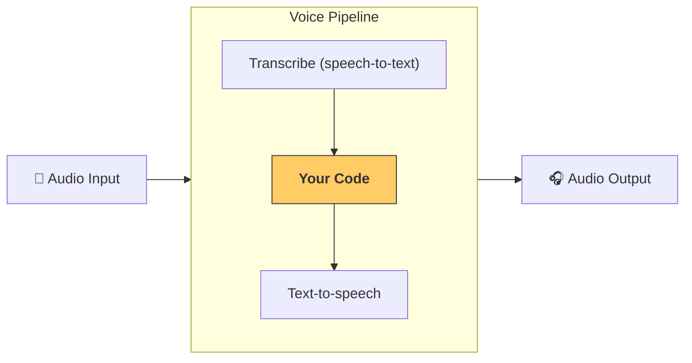

---
search:
  exclude: true
---
# パイプラインとワークフロー

`VoicePipeline` は、エージェント的なワークフローを音声アプリへ簡単に変換するためのクラスです。ワークフローを渡すだけで、入力音声の文字起こし、音声終了の検知、適切なタイミングでのワークフロー呼び出し、そしてワークフロー出力を音声へ戻す処理を自動で行います。



## パイプラインの設定

パイプラインを作成するとき、次の項目を設定できます:

1. [`workflow`][agents.voice.workflow.VoiceWorkflowBase] — 新しい音声が文字起こしされるたびに実行されるコード。
2. [`speech-to-text`][agents.voice.model.STTModel] と [`text-to-speech`][agents.voice.model.TTSModel] の各モデル。
3. [`config`][agents.voice.pipeline_config.VoicePipelineConfig] — 以下のような設定を行えます。  
    - モデルプロバイダー: モデル名をモデルにマッピングします  
    - トレーシング: トレーシングの無効化、音声ファイルのアップロード有無、ワークフロー名、トレース ID など  
    - TTS と STT モデルの設定: プロンプト、言語、データ型など

## パイプラインの実行

パイプラインは [`run()`][agents.voice.pipeline.VoicePipeline.run] メソッドで実行できます。音声入力は 2 つの形式で渡せます:

1. [`AudioInput`][agents.voice.input.AudioInput]  
   完全な音声ファイルがあり、その文字起こしに対して結果だけを生成したい場合に使用します。話者がいつ話し終えたかを検知する必要がないケース、たとえば事前録音された音声やユーザーが話し終えるタイミングが明確なプッシュ・トゥ・トーク アプリで便利です。  
2. [`StreamedAudioInput`][agents.voice.input.StreamedAudioInput]  
   ユーザーが話し終えたタイミングを検知する必要がある場合に使用します。音声チャンクを検知し次第プッシュでき、パイプラインが「アクティビティ検知」により適切なタイミングでエージェント ワークフローを自動実行します。

## 結果

音声パイプライン実行の結果は [`StreamedAudioResult`][agents.voice.result.StreamedAudioResult] です。このオブジェクトはイベントをストリーム形式で受け取るためのものです。イベントの型 [`VoiceStreamEvent`][agents.voice.events.VoiceStreamEvent] には以下があります。

1. [`VoiceStreamEventAudio`][agents.voice.events.VoiceStreamEventAudio] — 音声チャンクを含みます。  
2. [`VoiceStreamEventLifecycle`][agents.voice.events.VoiceStreamEventLifecycle] — ターン開始や終了といったライフサイクルイベントを通知します。  
3. [`VoiceStreamEventError`][agents.voice.events.VoiceStreamEventError] — エラーイベントです。

```python

result = await pipeline.run(input)

async for event in result.stream():
    if event.type == "voice_stream_event_audio":
        # play audio
    elif event.type == "voice_stream_event_lifecycle":
        # lifecycle
    elif event.type == "voice_stream_event_error"
        # error
    ...
```

## ベストプラクティス

### 割り込み

現在、 Agents SDK には [`StreamedAudioInput`][agents.voice.input.StreamedAudioInput] に対する組み込みの割り込みサポートはありません。検知された各ターンごとにワークフローが個別に実行されます。アプリケーション側で割り込みを処理したい場合は [`VoiceStreamEventLifecycle`][agents.voice.events.VoiceStreamEventLifecycle] を監視してください。`turn_started` は新しいターンが文字起こしされ、処理が始まったことを示します。`turn_ended` は該当ターンのすべての音声が送信された後に発火します。モデルがターンを開始した際にマイクをミュートし、ターンに関連する音声をすべて送った後でアンミュートするといった制御にこれらのイベントを利用できます。