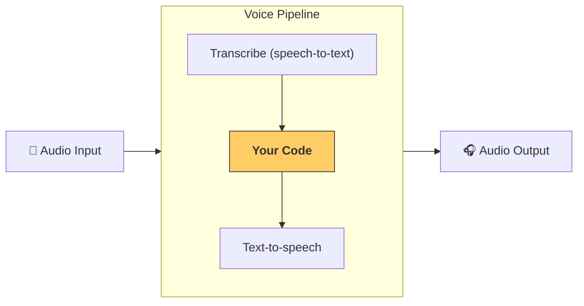

---
search:
  exclude: true
---
# パイプラインとワークフロー

[`VoicePipeline`][agents.voice.pipeline.VoicePipeline] は、エージェント ワークフローを音声アプリに簡単に変換できるクラスです。実行するワークフローを渡すと、パイプラインが入力音声の書き起こし、音声の終了検知、適切なタイミングでのワークフロー呼び出し、さらにワークフローの出力を音声へ戻す処理までを引き受けます。



## パイプラインの設定

パイプラインを作成する際には、次の項目を設定できます。

1. [`workflow`][agents.voice.workflow.VoiceWorkflowBase]。新しい音声が書き起こされるたびに実行されるコードです。
2. 使用する [`speech-to-text`][agents.voice.model.STTModel] と [`text-to-speech`][agents.voice.model.TTSModel] のモデルです。
3. [`config`][agents.voice.pipeline_config.VoicePipelineConfig]。次のような項目を設定できます。
    - モデルプロバイダー。モデル名をモデルに対応付けできます
    - トレーシング。トレーシングの無効化可否、音声ファイルのアップロード可否、ワークフロー名、トレース ID など
    -  TTS と STT モデルの設定（使用するプロンプト、言語、データ型など）

## パイプラインの実行

パイプラインは [`run()`][agents.voice.pipeline.VoicePipeline.run] メソッドで実行でき、音声入力を次の 2 つの形式で渡せます。

1. [`AudioInput`][agents.voice.input.AudioInput] は、完全な音声の書き起こしがあり、その結果だけを生成したい場合に使います。話者の発話終了を検知する必要がない状況、たとえば事前録音の音声がある場合や、ユーザーの発話終了が明確な  push-to-talk アプリで有用です。
2. [`StreamedAudioInput`][agents.voice.input.StreamedAudioInput] は、ユーザーの発話終了を検知する必要がある場合に使います。検出された音声チャンクを逐次プッシュでき、音声パイプラインが 「activity detection」 と呼ばれる処理により適切なタイミングでエージェントのワークフローを自動実行します。

## 結果

音声パイプラインの実行結果は [`StreamedAudioResult`][agents.voice.result.StreamedAudioResult] です。これは、発生したイベントを順次ストリーミングできるオブジェクトです。[`VoiceStreamEvent`][agents.voice.events.VoiceStreamEvent] にはいくつかの種類があり、たとえば次のとおりです。

1. [`VoiceStreamEventAudio`][agents.voice.events.VoiceStreamEventAudio]。音声チャンクを含みます。
2. [`VoiceStreamEventLifecycle`][agents.voice.events.VoiceStreamEventLifecycle]。ターンの開始や終了といったライフサイクルイベントを通知します。
3. [`VoiceStreamEventError`][agents.voice.events.VoiceStreamEventError]。エラーイベントです。

```python

result = await pipeline.run(input)

async for event in result.stream():
    if event.type == "voice_stream_event_audio":
        # play audio
    elif event.type == "voice_stream_event_lifecycle":
        # lifecycle
    elif event.type == "voice_stream_event_error"
        # error
    ...
```

## ベストプラクティス

### 割り込み

現在、Agents SDK は [`StreamedAudioInput`][agents.voice.input.StreamedAudioInput] に対する組み込みの割り込み機能をサポートしていません。その代わり、検出された各ターンごとに、ワークフローの個別の実行がトリガーされます。アプリケーション内で割り込みを処理したい場合は、[`VoiceStreamEventLifecycle`][agents.voice.events.VoiceStreamEventLifecycle] のイベントを監視してください。`turn_started` は新しいターンが書き起こされ、処理が開始されたことを示します。`turn_ended` は該当のターンに対するすべての音声が送出された後に発火します。これらのイベントを利用して、モデルがターンを開始したときに話者のマイクをミュートし、そのターンに関連する音声をすべて送出し終えた後にミュートを解除するといった制御ができます。