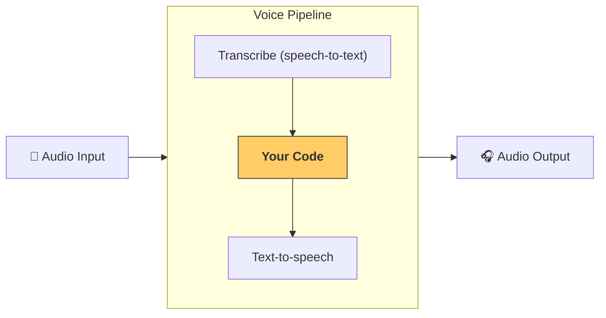

---
search:
  exclude: true
---
# パイプラインとワークフロー

[`VoicePipeline`][agents.voice.pipeline.VoicePipeline] は、エージェントのワークフローを音声アプリに変換するのを容易にするクラスです。実行したいワークフローを渡すと、パイプラインが入力音声の文字起こし、音声終了の検出、適切なタイミングでのワークフローの呼び出し、ワークフロー出力の音声化までを処理します。



## パイプラインの設定

パイプライン作成時には、次の項目を設定できます。

1. 新しい音声が文字起こしされるたびに実行されるコードである [`workflow`][agents.voice.workflow.VoiceWorkflowBase]
2. 使用する [`speech-to-text`][agents.voice.model.STTModel] と [`text-to-speech`][agents.voice.model.TTSModel] のモデル
3. 次のような設定が可能な [`config`][agents.voice.pipeline_config.VoicePipelineConfig]
    - モデル名をモデルにマッピングするモデルプロバイダー
    - トレーシング（トレーシングの無効化、音声ファイルのアップロード有無、ワークフロー名、トレース ID など）
    - プロンプト、言語、使用するデータ型などの TTS と STT モデルの設定

## パイプラインの実行

パイプラインは [`run()`][agents.voice.pipeline.VoicePipeline.run] メソッドで実行でき、音声入力を 2 つの形式で渡せます。

1. [`AudioInput`][agents.voice.input.AudioInput] は、完全な音声トランスクリプトがあり、その結果だけを生成したい場合に使用します。これは、話者の発話終了を検出する必要がないケース（例：事前録音の音声や、ユーザーの発話が明確に終了するプッシュトゥトークのアプリ）で有用です。
2. [`StreamedAudioInput`][agents.voice.input.StreamedAudioInput] は、ユーザーの発話終了を検出する必要がある場合に使用します。検出された音声チャンクを逐次プッシュでき、パイプラインは「アクティビティ検知」と呼ばれるプロセスを通じて、適切なタイミングでエージェントのワークフローを自動実行します。

## 結果

音声パイプライン実行の結果は [`StreamedAudioResult`][agents.voice.result.StreamedAudioResult] です。これは、発生するイベントをストリーミングできるオブジェクトです。いくつかの種類の [`VoiceStreamEvent`][agents.voice.events.VoiceStreamEvent] があり、次を含みます。

1. 音声チャンクを含む [`VoiceStreamEventAudio`][agents.voice.events.VoiceStreamEventAudio]
2. ターンの開始や終了などのライフサイクルイベントを通知する [`VoiceStreamEventLifecycle`][agents.voice.events.VoiceStreamEventLifecycle]
3. エラーイベントである [`VoiceStreamEventError`][agents.voice.events.VoiceStreamEventError]

```python

result = await pipeline.run(input)

async for event in result.stream():
    if event.type == "voice_stream_event_audio":
        # play audio
    elif event.type == "voice_stream_event_lifecycle":
        # lifecycle
    elif event.type == "voice_stream_event_error"
        # error
    ...
```

## ベストプラクティス

### 割り込み

Agents SDK は現在、[`StreamedAudioInput`][agents.voice.input.StreamedAudioInput] に対する組み込みの割り込み対応をサポートしていません。代わりに、検出された各ターンごとにワークフローの実行が個別にトリガーされます。アプリケーション内で割り込み処理を行いたい場合は、[`VoiceStreamEventLifecycle`][agents.voice.events.VoiceStreamEventLifecycle] イベントを監視してください。`turn_started` は新しいターンが文字起こしされ処理が開始されたことを示し、`turn_ended` は該当ターンの音声送出がすべて完了した後に発火します。モデルがターンを開始した際に話者のマイクをミュートし、ターンに関連する音声をすべて送出し終えた後にアンミュートする、といった処理にこれらのイベントを利用できます。