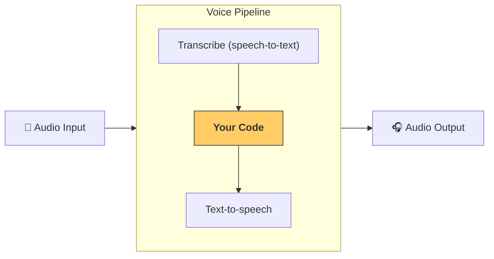

---
search:
  exclude: true
---
# クイックスタート

## 前提条件

まず、ベースとなる [Quickstart の手順](../quickstart.md) に従って  Agents SDK  をセットアップし、仮想環境を作成してください。その後、SDK の音声関連のオプション依存関係をインストールします。

```bash
pip install 'openai-agents[voice]'
```

## コンセプト

ここで押さえておくべき主要な概念は [`VoicePipeline`][agents.voice.pipeline.VoicePipeline] です。これは次の 3 ステップから成ります。

1. 音声をテキストに変換する  speech-to-text  モデルを実行する  
2. 通常はエージェント的ワークフローとなるあなたのコードを実行し、実行結果を生成する  
3. その結果テキストを再び音声に変換する  text-to-speech  モデルを実行する  



## エージェント

まずはエージェントをいくつか設定しましょう。すでにこの SDK でエージェントを構築したことがあれば、馴染みのある流れのはずです。ここでは複数のエージェント、ハンドオフ、そしてツールを用意します。

```python
import asyncio
import random

from agents import (
    Agent,
    function_tool,
)
from agents.extensions.handoff_prompt import prompt_with_handoff_instructions


@function_tool
def get_weather(city: str) -> str:
    """Get the weather for a given city."""
    print(f"[debug] get_weather called with city: {city}")
    choices = ["sunny", "cloudy", "rainy", "snowy"]
    return f"The weather in {city} is {random.choice(choices)}."


spanish_agent = Agent(
    name="Spanish",
    handoff_description="A spanish speaking agent.",
    instructions=prompt_with_handoff_instructions(
        "You're speaking to a human, so be polite and concise. Speak in Spanish.",
    ),
    model="gpt-4o-mini",
)

agent = Agent(
    name="Assistant",
    instructions=prompt_with_handoff_instructions(
        "You're speaking to a human, so be polite and concise. If the user speaks in Spanish, handoff to the spanish agent.",
    ),
    model="gpt-4o-mini",
    handoffs=[spanish_agent],
    tools=[get_weather],
)
```

## 音声パイプライン

[`SingleAgentVoiceWorkflow`][agents.voice.workflow.SingleAgentVoiceWorkflow] をワークフローとして用いた、シンプルな音声パイプラインを設定します。

```python
from agents.voice import SingleAgentVoiceWorkflow, VoicePipeline
pipeline = VoicePipeline(workflow=SingleAgentVoiceWorkflow(agent))
```

## パイプラインの実行

```python
import numpy as np
import sounddevice as sd
from agents.voice import AudioInput

# For simplicity, we'll just create 3 seconds of silence
# In reality, you'd get microphone data
buffer = np.zeros(24000 * 3, dtype=np.int16)
audio_input = AudioInput(buffer=buffer)

result = await pipeline.run(audio_input)

# Create an audio player using `sounddevice`
player = sd.OutputStream(samplerate=24000, channels=1, dtype=np.int16)
player.start()

# Play the audio stream as it comes in
async for event in result.stream():
    if event.type == "voice_stream_event_audio":
        player.write(event.data)

```

## 統合

```python
import asyncio
import random

import numpy as np
import sounddevice as sd

from agents import (
    Agent,
    function_tool,
    set_tracing_disabled,
)
from agents.voice import (
    AudioInput,
    SingleAgentVoiceWorkflow,
    VoicePipeline,
)
from agents.extensions.handoff_prompt import prompt_with_handoff_instructions


@function_tool
def get_weather(city: str) -> str:
    """Get the weather for a given city."""
    print(f"[debug] get_weather called with city: {city}")
    choices = ["sunny", "cloudy", "rainy", "snowy"]
    return f"The weather in {city} is {random.choice(choices)}."


spanish_agent = Agent(
    name="Spanish",
    handoff_description="A spanish speaking agent.",
    instructions=prompt_with_handoff_instructions(
        "You're speaking to a human, so be polite and concise. Speak in Spanish.",
    ),
    model="gpt-4o-mini",
)

agent = Agent(
    name="Assistant",
    instructions=prompt_with_handoff_instructions(
        "You're speaking to a human, so be polite and concise. If the user speaks in Spanish, handoff to the spanish agent.",
    ),
    model="gpt-4o-mini",
    handoffs=[spanish_agent],
    tools=[get_weather],
)


async def main():
    pipeline = VoicePipeline(workflow=SingleAgentVoiceWorkflow(agent))
    buffer = np.zeros(24000 * 3, dtype=np.int16)
    audio_input = AudioInput(buffer=buffer)

    result = await pipeline.run(audio_input)

    # Create an audio player using `sounddevice`
    player = sd.OutputStream(samplerate=24000, channels=1, dtype=np.int16)
    player.start()

    # Play the audio stream as it comes in
    async for event in result.stream():
        if event.type == "voice_stream_event_audio":
            player.write(event.data)


if __name__ == "__main__":
    asyncio.run(main())
```

この例を実行すると、エージェントがあなたに話しかけてきます。実際にエージェントと会話できるデモは、[examples/voice/static](https://github.com/openai/openai-agents-python/tree/main/examples/voice/static) にあるサンプルをご覧ください。