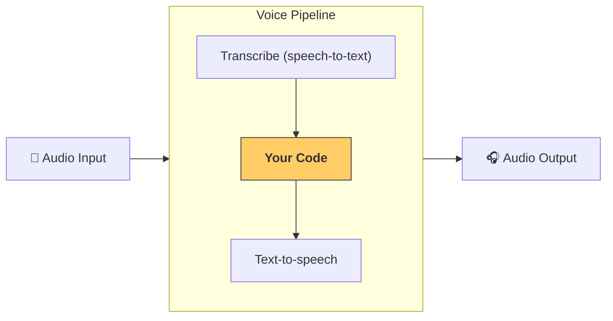

---
search:
  exclude: true
---
# 파이프라인과 워크플로

[`VoicePipeline`][agents.voice.pipeline.VoicePipeline] 클래스는 에이전트 기반 워크플로를 손쉽게 음성 앱으로 전환할 수 있게 해줍니다. 실행할 워크플로를 전달하면, 파이프라인이 입력 오디오를 음성 인식하고, 오디오 종료를 감지하며, 적절한 시점에 워크플로를 호출하고, 워크플로 출력을 다시 오디오로 변환하는 작업을 처리합니다.



## 파이프라인 구성

파이프라인을 만들 때 다음을 설정할 수 있습니다:

1. 매번 새로운 오디오가 전사될 때 실행되는 코드인 [`workflow`][agents.voice.workflow.VoiceWorkflowBase]
2. 사용하는 [`speech-to-text`][agents.voice.model.STTModel] 및 [`text-to-speech`][agents.voice.model.TTSModel] 모델
3. 다음과 같은 항목을 구성할 수 있는 [`config`][agents.voice.pipeline_config.VoicePipelineConfig]
    - 모델 제공자: 모델 이름을 실제 모델에 매핑
    - 트레이싱: 트레이싱 비활성화 여부, 오디오 파일 업로드 여부, 워크플로 이름, 트레이스 ID 등
    - TTS 및 STT 모델의 설정: 프롬프트, 언어, 사용하는 데이터 타입 등

## 파이프라인 실행

파이프라인은 [`run()`][agents.voice.pipeline.VoicePipeline.run] 메서드를 통해 실행할 수 있으며, 오디오 입력을 두 가지 형태로 전달할 수 있습니다:

1. [`AudioInput`][agents.voice.input.AudioInput]은 전체 오디오 전사가 있을 때 이를 처리해 결과만 생성하고자 할 때 사용합니다. 이는 화자가 말을 마쳤는지 감지할 필요가 없는 경우, 예를 들어 사전 녹음된 오디오이거나 사용자가 말하기를 마치는 시점이 명확한 푸시투토크 앱에서 유용합니다
2. [`StreamedAudioInput`][agents.voice.input.StreamedAudioInput]은 사용자가 말을 마치는 시점을 감지해야 할 수 있는 경우에 사용합니다. 감지되는 대로 오디오 청크를 푸시할 수 있으며, 음성 파이프라인이 "activity detection"(음성 활동 감지) 과정을 통해 적절한 시점에 자동으로 에이전트 워크플로를 실행합니다

## 결과

음성 파이프라인 실행의 결과는 [`StreamedAudioResult`][agents.voice.result.StreamedAudioResult]입니다. 이는 발생하는 이벤트를 스트리밍으로 수신할 수 있는 객체입니다. 다음과 같은 여러 종류의 [`VoiceStreamEvent`][agents.voice.events.VoiceStreamEvent]가 있습니다:

1. 오디오 청크를 포함하는 [`VoiceStreamEventAudio`][agents.voice.events.VoiceStreamEventAudio]
2. 턴 시작/종료와 같은 라이프사이클 이벤트를 알려주는 [`VoiceStreamEventLifecycle`][agents.voice.events.VoiceStreamEventLifecycle]
3. 오류 이벤트인 [`VoiceStreamEventError`][agents.voice.events.VoiceStreamEventError]

```python

result = await pipeline.run(input)

async for event in result.stream():
    if event.type == "voice_stream_event_audio":
        # play audio
    elif event.type == "voice_stream_event_lifecycle":
        # lifecycle
    elif event.type == "voice_stream_event_error"
        # error
    ...
```

## 모범 사례

### 인터럽션(중단 처리)

Agents SDK는 현재 [`StreamedAudioInput`][agents.voice.input.StreamedAudioInput]에 대해 내장된 인터럽션(중단 처리) 기능을 제공하지 않습니다. 대신 감지된 각 턴마다 워크플로의 별도 실행이 트리거됩니다. 애플리케이션 내에서 인터럽션을 처리하려면 [`VoiceStreamEventLifecycle`][agents.voice.events.VoiceStreamEventLifecycle] 이벤트를 구독할 수 있습니다. `turn_started`는 새로운 턴이 전사되었고 처리가 시작되었음을 나타냅니다. `turn_ended`는 해당 턴의 모든 오디오가 전송된 후 트리거됩니다. 모델이 턴을 시작할 때 화자의 마이크를 음소거하고, 해당 턴의 관련 오디오를 모두 전송한 뒤 음소거를 해제하는 방식으로 이러한 이벤트를 활용할 수 있습니다