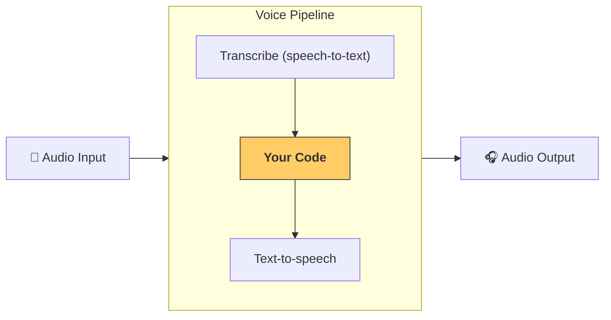

---
search:
  exclude: true
---
# 파이프라인과 워크플로우

[`VoicePipeline`][agents.voice.pipeline.VoicePipeline] 클래스는 에이전트형 워크플로우를 손쉽게 음성 앱으로 전환할 수 있게 해줍니다. 실행할 워크플로우를 전달하면, 파이프라인이 입력 오디오의 음성 인식, 오디오 종료 감지, 적절한 타이밍에 워크플로우 호출, 워크플로우 출력의 오디오 변환까지 처리합니다.



## 파이프라인 구성

파이프라인을 생성할 때 다음을 설정할 수 있습니다:

1. [`workflow`][agents.voice.workflow.VoiceWorkflowBase] — 새 오디오가 전사될 때마다 실행되는 코드
2. 사용하는 [`speech-to-text`][agents.voice.model.STTModel] 및 [`text-to-speech`][agents.voice.model.TTSModel] 모델
3. [`config`][agents.voice.pipeline_config.VoicePipelineConfig] — 다음과 같은 항목을 구성 가능:
    - 모델 제공자(모델 이름을 실제 모델로 매핑)
    - 트레이싱 설정(트레이싱 비활성화 여부, 오디오 파일 업로드 여부, 워크플로우 이름, 트레이스 ID 등)
    - TTS/STT 모델의 설정(프롬프트, 언어, 사용되는 데이터 타입 등)

## 파이프라인 실행

파이프라인은 [`run()`][agents.voice.pipeline.VoicePipeline.run] 메서드로 실행하며, 두 가지 형태로 오디오 입력을 전달할 수 있습니다:

1. [`AudioInput`][agents.voice.input.AudioInput] — 전체 오디오 전사가 있고 그에 대한 결과만 생성하면 되는 경우 사용합니다. 예를 들어, 사전 녹음된 오디오나 사용자가 말하기를 마치는 시점이 명확한 푸시투토크 앱처럼 발화 종료 감지가 필요 없는 경우에 유용합니다
2. [`StreamedAudioInput`][agents.voice.input.StreamedAudioInput] — 사용자의 발화 종료 감지가 필요할 수 있는 경우에 사용합니다. 감지된 대로 오디오 청크를 푸시할 수 있으며, 음성 파이프라인은 "activity detection(활동 감지)"이라는 프로세스를 통해 적절한 시점에 에이전트 워크플로우를 자동으로 실행합니다

## 결과

음성 파이프라인 실행 결과는 [`StreamedAudioResult`][agents.voice.result.StreamedAudioResult] 입니다. 이는 발생하는 이벤트를 스트리밍할 수 있는 객체입니다. 다음과 같은 여러 종류의 [`VoiceStreamEvent`][agents.voice.events.VoiceStreamEvent] 가 있습니다:

1. [`VoiceStreamEventAudio`][agents.voice.events.VoiceStreamEventAudio] — 오디오 청크를 포함
2. [`VoiceStreamEventLifecycle`][agents.voice.events.VoiceStreamEventLifecycle] — 턴 시작/종료와 같은 라이프사이클 이벤트 알림
3. [`VoiceStreamEventError`][agents.voice.events.VoiceStreamEventError] — 오류 이벤트

```python

result = await pipeline.run(input)

async for event in result.stream():
    if event.type == "voice_stream_event_audio":
        # play audio
    elif event.type == "voice_stream_event_lifecycle":
        # lifecycle
    elif event.type == "voice_stream_event_error"
        # error
    ...
```

## 모범 사례

### 인터럽션(중단 처리)

Agents SDK 는 현재 [`StreamedAudioInput`][agents.voice.input.StreamedAudioInput] 에 대해 내장된 인터럽션(중단 처리) 기능을 지원하지 않습니다. 대신, 감지된 각 턴마다 워크플로우의 별도 실행이 트리거됩니다. 애플리케이션 내부에서 인터럽션(중단 처리)을 다루고자 한다면 [`VoiceStreamEventLifecycle`][agents.voice.events.VoiceStreamEventLifecycle] 이벤트를 구독할 수 있습니다. `turn_started` 는 새 턴이 전사되어 처리가 시작되었음을 나타냅니다. `turn_ended` 는 해당 턴의 모든 오디오 디스패치가 완료된 후 트리거됩니다. 이 이벤트를 사용해 모델이 턴을 시작할 때 화자의 마이크를 음소거하고, 해당 턴의 관련 오디오를 모두 플러시한 후 음소거를 해제할 수 있습니다.