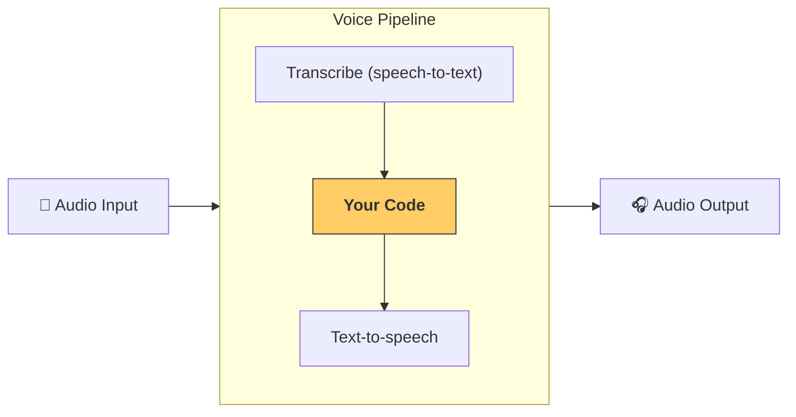

---
search:
  exclude: true
---
# 빠른 시작

## 사전 준비

OpenAI Agents SDK의 기본 [빠른 시작 안내](../quickstart.md)를 따라 가상 환경을 설정했는지 확인하세요. 그런 다음 SDK에서 선택적 음성 관련 의존성을 설치하세요:

```bash
pip install 'openai-agents[voice]'
```

## 개념

핵심 개념은 [`VoicePipeline`][agents.voice.pipeline.VoicePipeline]이며, 3단계 프로세스로 구성됩니다:

1. 음성을 텍스트로 변환하기 위해 음성-텍스트 모델을 실행
2. 결과를 생성하기 위해 보통 에이전트형 워크플로인 코드를 실행
3. 결과 텍스트를 다시 오디오로 변환하기 위해 텍스트-음성 모델을 실행



## 에이전트

먼저 에이전트를 몇 개 설정해 봅시다. 이 SDK로 에이전트를 만들어 본 적이 있다면 익숙하게 느껴질 것입니다. 에이전트 몇 개와 핸드오프, 그리고 하나의 도구를 사용합니다.

```python
import asyncio
import random

from agents import (
    Agent,
    function_tool,
)
from agents.extensions.handoff_prompt import prompt_with_handoff_instructions


@function_tool
def get_weather(city: str) -> str:
    """Get the weather for a given city."""
    print(f"[debug] get_weather called with city: {city}")
    choices = ["sunny", "cloudy", "rainy", "snowy"]
    return f"The weather in {city} is {random.choice(choices)}."


spanish_agent = Agent(
    name="Spanish",
    handoff_description="A spanish speaking agent.",
    instructions=prompt_with_handoff_instructions(
        "You're speaking to a human, so be polite and concise. Speak in Spanish.",
    ),
    model="gpt-4.1",
)

agent = Agent(
    name="Assistant",
    instructions=prompt_with_handoff_instructions(
        "You're speaking to a human, so be polite and concise. If the user speaks in Spanish, handoff to the spanish agent.",
    ),
    model="gpt-4.1",
    handoffs=[spanish_agent],
    tools=[get_weather],
)
```

## 음성 파이프라인

워크플로로 [`SingleAgentVoiceWorkflow`][agents.voice.workflow.SingleAgentVoiceWorkflow]를 사용해 간단한 음성 파이프라인을 설정합니다.

```python
from agents.voice import SingleAgentVoiceWorkflow, VoicePipeline
pipeline = VoicePipeline(workflow=SingleAgentVoiceWorkflow(agent))
```

## 파이프라인 실행

```python
import numpy as np
import sounddevice as sd
from agents.voice import AudioInput

# For simplicity, we'll just create 3 seconds of silence
# In reality, you'd get microphone data
buffer = np.zeros(24000 * 3, dtype=np.int16)
audio_input = AudioInput(buffer=buffer)

result = await pipeline.run(audio_input)

# Create an audio player using `sounddevice`
player = sd.OutputStream(samplerate=24000, channels=1, dtype=np.int16)
player.start()

# Play the audio stream as it comes in
async for event in result.stream():
    if event.type == "voice_stream_event_audio":
        player.write(event.data)

```

## 통합

```python
import asyncio
import random

import numpy as np
import sounddevice as sd

from agents import (
    Agent,
    function_tool,
    set_tracing_disabled,
)
from agents.voice import (
    AudioInput,
    SingleAgentVoiceWorkflow,
    VoicePipeline,
)
from agents.extensions.handoff_prompt import prompt_with_handoff_instructions


@function_tool
def get_weather(city: str) -> str:
    """Get the weather for a given city."""
    print(f"[debug] get_weather called with city: {city}")
    choices = ["sunny", "cloudy", "rainy", "snowy"]
    return f"The weather in {city} is {random.choice(choices)}."


spanish_agent = Agent(
    name="Spanish",
    handoff_description="A spanish speaking agent.",
    instructions=prompt_with_handoff_instructions(
        "You're speaking to a human, so be polite and concise. Speak in Spanish.",
    ),
    model="gpt-4.1",
)

agent = Agent(
    name="Assistant",
    instructions=prompt_with_handoff_instructions(
        "You're speaking to a human, so be polite and concise. If the user speaks in Spanish, handoff to the spanish agent.",
    ),
    model="gpt-4.1",
    handoffs=[spanish_agent],
    tools=[get_weather],
)


async def main():
    pipeline = VoicePipeline(workflow=SingleAgentVoiceWorkflow(agent))
    buffer = np.zeros(24000 * 3, dtype=np.int16)
    audio_input = AudioInput(buffer=buffer)

    result = await pipeline.run(audio_input)

    # Create an audio player using `sounddevice`
    player = sd.OutputStream(samplerate=24000, channels=1, dtype=np.int16)
    player.start()

    # Play the audio stream as it comes in
    async for event in result.stream():
        if event.type == "voice_stream_event_audio":
            player.write(event.data)


if __name__ == "__main__":
    asyncio.run(main())
```

이 예제를 실행하면 에이전트가 직접 말을 겁니다! 직접 에이전트와 대화할 수 있는 데모는 [examples/voice/static](https://github.com/openai/openai-agents-python/tree/main/examples/voice/static)에서 확인하세요.