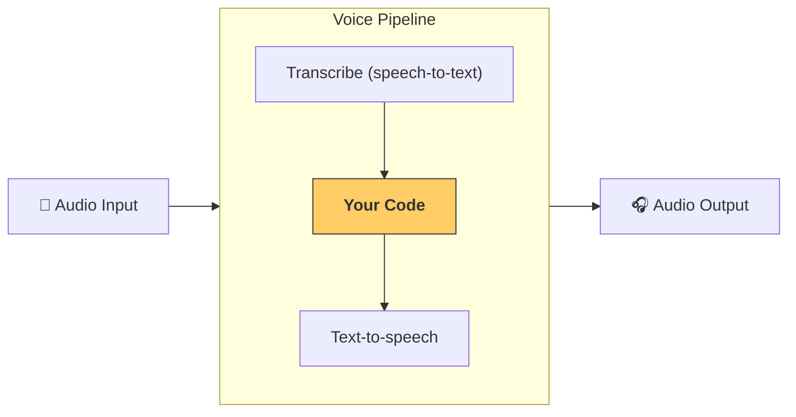

---
search:
  exclude: true
---
# 流水线与工作流

[`VoicePipeline`][agents.voice.pipeline.VoicePipeline] 是一个便于将你的智能体工作流变成语音应用的类。你传入一个要运行的工作流，流水线会负责转录输入音频、检测音频结束、在正确的时间调用你的工作流，并将工作流输出再转换为音频。



## 配置流水线

创建流水线时，你可以设置以下内容：

1. [`workflow`][agents.voice.workflow.VoiceWorkflowBase]：即每当有新的音频被转录时运行的代码。
2. 使用的 [`speech-to-text`][agents.voice.model.STTModel] 和 [`text-to-speech`][agents.voice.model.TTSModel] 模型
3. [`config`][agents.voice.pipeline_config.VoicePipelineConfig]：用于配置如下内容：
    - 模型提供方，可将模型名称映射到具体模型
    - 追踪，包括是否禁用追踪、是否上传音频文件、工作流名称、追踪 ID 等
    - TTS 与 STT 模型的设置，如提示词、语言和使用的数据类型

## 运行流水线

你可以通过 [`run()`][agents.voice.pipeline.VoicePipeline.run] 方法运行流水线，可用两种形式传入音频输入：

1. 当你已有完整的音频转录，仅需为其生成结果时使用 [`AudioInput`][agents.voice.input.AudioInput]。这在无需检测说话者何时结束的场景很有用；例如，已有预录音频，或在“按键说话”应用中用户结束说话的时机是明确的。
2. 当你可能需要检测用户何时说完时使用 [`StreamedAudioInput`][agents.voice.input.StreamedAudioInput]。它允许你在检测到音频片段时持续推送，语音流水线会通过“活动检测”的过程，在合适的时间自动运行智能体工作流。

## 结果

一次语音流水线运行的结果是 [`StreamedAudioResult`][agents.voice.result.StreamedAudioResult]。这是一个可让你在事件发生时进行流式接收的对象。存在几种 [`VoiceStreamEvent`][agents.voice.events.VoiceStreamEvent]，包括：

1. [`VoiceStreamEventAudio`][agents.voice.events.VoiceStreamEventAudio]，包含一段音频数据。
2. [`VoiceStreamEventLifecycle`][agents.voice.events.VoiceStreamEventLifecycle]，告知你诸如回合开始或结束等生命周期事件。
3. [`VoiceStreamEventError`][agents.voice.events.VoiceStreamEventError]，表示错误事件。

```python

result = await pipeline.run(input)

async for event in result.stream():
    if event.type == "voice_stream_event_audio":
        # play audio
    elif event.type == "voice_stream_event_lifecycle":
        # lifecycle
    elif event.type == "voice_stream_event_error"
        # error
    ...
```

## 最佳实践

### 打断

Agents SDK 目前对 [`StreamedAudioInput`][agents.voice.input.StreamedAudioInput] 不提供任何内置的打断支持。相反，每次检测到一个回合都会触发你的工作流单独运行一次。如果你想在应用内处理打断，可以监听 [`VoiceStreamEventLifecycle`][agents.voice.events.VoiceStreamEventLifecycle] 事件。`turn_started` 表示一个新回合已被转录且开始处理；`turn_ended` 会在相应回合的所有音频都已分发后触发。你可以利用这些事件在模型开始一个回合时静音说话者的麦克风，并在你为该回合相关音频全部播放完成后取消静音。