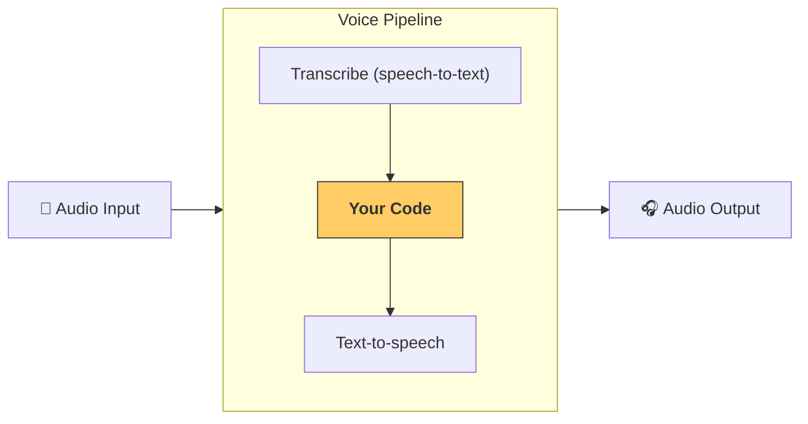

---
search:
  exclude: true
---
# 管道和工作流

[`VoicePipeline`][agents.voice.pipeline.VoicePipeline] 是一个可以轻松将智能体工作流转换为语音应用的类。您传入要运行的工作流，管道会负责转录输入音频、检测音频何时结束、在适当时间调用您的工作流，并将工作流输出转换回音频。



## 配置管道

创建管道时，您可以设置以下内容：

1. [`workflow`][agents.voice.workflow.VoiceWorkflowBase]，即每次转录新音频时运行的代码
2. 使用的 [`speech-to-text`][agents.voice.model.STTModel] 和 [`text-to-speech`][agents.voice.model.TTSModel] 模型
3. [`config`][agents.voice.pipeline_config.VoicePipelineConfig]，可让您配置以下内容：
    - 模型提供程序，可将模型名称映射到模型
    - 追踪，包括是否禁用追踪、是否上传音频文件、工作流名称、追踪ID等
    - TTS 和 STT 模型的设置，如提示、语言和使用的数据类型

## 运行管道

您可以通过 [`run()`][agents.voice.pipeline.VoicePipeline.run] 方法运行管道，该方法允许您以两种形式传入音频输入：

1. [`AudioInput`][agents.voice.input.AudioInput] 用于当您有完整的音频转录，并且只想为其生成结果时。这在您不需要检测说话者何时完成发言的情况下很有用；例如，当您有预录制音频或在按下说话应用中用户完成发言很明确时。
2. [`StreamedAudioInput`][agents.voice.input.StreamedAudioInput] 用于当您可能需要检测用户何时完成发言时。它允许您在检测到音频块时推送它们，语音管道将通过称为"活动检测"的过程在适当时间自动运行智能体工作流。

## 结果

语音管道运行的结果是 [`StreamedAudioResult`][agents.voice.result.StreamedAudioResult]。这是一个允许您流式接收发生事件的对象。有几种 [`VoiceStreamEvent`][agents.voice.events.VoiceStreamEvent]，包括：

1. [`VoiceStreamEventAudio`][agents.voice.events.VoiceStreamEventAudio]，包含音频块
2. [`VoiceStreamEventLifecycle`][agents.voice.events.VoiceStreamEventLifecycle]，通知生命周期事件，如轮次开始或结束
3. [`VoiceStreamEventError`][agents.voice.events.VoiceStreamEventError]，是错误事件

```python

result = await pipeline.run(input)

async for event in result.stream():
    if event.type == "voice_stream_event_audio":
        # play audio
    elif event.type == "voice_stream_event_lifecycle":
        # lifecycle
    elif event.type == "voice_stream_event_error"
        # error
    ...
```

## 最佳实践

### 中断

Agents SDK 目前不支持 [`StreamedAudioInput`][agents.voice.input.StreamedAudioInput] 的任何内置中断支持。相反，对于每个检测到的轮次，它将触发您工作流的单独运行。如果您想在应用程序内处理中断，可以监听 [`VoiceStreamEventLifecycle`][agents.voice.events.VoiceStreamEventLifecycle] 事件。`turn_started` 将表示新轮次已被转录并且处理正在开始。`turn_ended` 将在相应轮次的所有音频被调度后触发。您可以使用这些事件在模型开始轮次时静音说话者的麦克风，并在刷新轮次的所有相关音频后取消静音。