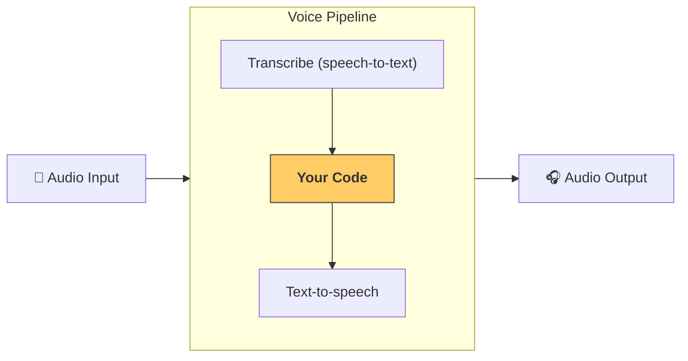

---
search:
  exclude: true
---
# 流水线与工作流

[`VoicePipeline`][agents.voice.pipeline.VoicePipeline] 是一个类，可轻松将你的智能体工作流变成语音应用。你传入一个要运行的工作流，流水线会负责转写输入音频、检测音频结束时间、在正确时机调用你的工作流，并将工作流输出重新转换为音频。



## 配置流水线

创建流水线时，你可以设置以下内容：

1. [`workflow`][agents.voice.workflow.VoiceWorkflowBase]，即每次有新音频被转写时运行的代码。
2. 所使用的 [`speech-to-text`][agents.voice.model.STTModel] 和 [`text-to-speech`][agents.voice.model.TTSModel] 模型
3. [`config`][agents.voice.pipeline_config.VoicePipelineConfig]，用于配置以下内容：
    - 模型提供方，可将模型名称映射到具体模型
    - 追踪，包括是否禁用追踪、是否上传音频文件、工作流名称、追踪 ID 等
    - TTS 和 STT 模型的设置，例如使用的 prompt、语言和数据类型

## 运行流水线

你可以通过 [`run()`][agents.voice.pipeline.VoicePipeline.run] 方法运行流水线，并以两种形式传入音频输入：

1. 当你已有完整的音频转写，只想为其生成结果时，使用 [`AudioInput`][agents.voice.input.AudioInput]。这在无需检测说话者何时结束的场景中很有用；例如，使用预录音频，或在按键说话应用中，用户结束说话的时机是明确的。
2. 当你可能需要检测用户何时结束说话时，使用 [`StreamedAudioInput`][agents.voice.input.StreamedAudioInput]。它允许你在检测到时持续推送音频块，语音流水线会通过称为“语音活动检测（activity detection）”的过程，在正确时机自动运行智能体工作流。

## 结果

语音流水线运行的结果为 [`StreamedAudioResult`][agents.voice.result.StreamedAudioResult]。该对象允许你在事件发生时进行流式接收。[`VoiceStreamEvent`][agents.voice.events.VoiceStreamEvent] 有几种类型，包括：

1. [`VoiceStreamEventAudio`][agents.voice.events.VoiceStreamEventAudio]，包含一段音频片段。
2. [`VoiceStreamEventLifecycle`][agents.voice.events.VoiceStreamEventLifecycle]，用于告知诸如轮次开始或结束等生命周期事件。
3. [`VoiceStreamEventError`][agents.voice.events.VoiceStreamEventError]，表示错误事件。

```python

result = await pipeline.run(input)

async for event in result.stream():
    if event.type == "voice_stream_event_audio":
        # play audio
    elif event.type == "voice_stream_event_lifecycle":
        # lifecycle
    elif event.type == "voice_stream_event_error"
        # error
    ...
```

## 最佳实践

### 打断

Agents SDK 目前不对 [`StreamedAudioInput`][agents.voice.input.StreamedAudioInput] 提供任何内建的打断支持。相反，对于每个检测到的轮次，它都会触发对你的工作流的单独运行。如果你想在应用内部处理打断，可以监听 [`VoiceStreamEventLifecycle`][agents.voice.events.VoiceStreamEventLifecycle] 事件。`turn_started` 表示新的轮次已被转写并开始处理。`turn_ended` 会在相应轮次的所有音频均已分发之后触发。你可以利用这些事件在模型开始一个轮次时将说话者的麦克风静音，并在你清空某个轮次的所有相关音频后再取消静音。