```mermaid
graph LR
    %% Input
    A["🎤 Audio Input"]

    %% Voice Pipeline
    subgraph Voice_Pipeline [Voice Pipeline]
        direction TB
        B["Transcribe (speech-to-text)"]
        C["Your Code"]:::highlight
        D["Text-to-speech"]
        B --> C --> D
    end

    %% Output
    E["🎧 Audio Output"]

    %% Flow
    A --> Voice_Pipeline
    Voice_Pipeline --> E

    %% Custom styling
    classDef highlight fill:#ffcc66,stroke:#333,stroke-width:1px,font-weight:700;

```

---
search:
  exclude: true
---
# 流水线与工作流

[`VoicePipeline`][agents.voice.pipeline.VoicePipeline] 是一个类，可轻松将你的智能体工作流变成语音应用。你传入要运行的工作流，流水线会负责转写输入音频、检测音频结束时间、在恰当时机调用你的工作流，并将工作流输出转换回音频。



## 配置流水线

创建流水线时，你可以设置以下内容：

1. [`workflow`][agents.voice.workflow.VoiceWorkflowBase]：每次有新音频被转写时运行的代码。
2. 使用的 [`speech-to-text`][agents.voice.model.STTModel] 和 [`text-to-speech`][agents.voice.model.TTSModel] 模型
3. [`config`][agents.voice.pipeline_config.VoicePipelineConfig]：用于配置以下内容：
    - 模型提供者，可将模型名称映射到具体模型
    - 追踪，包括是否禁用追踪、是否上传音频文件、工作流名称、追踪 ID 等
    - TTS 与 STT 模型设置，如提示词、语言和使用的数据类型

## 运行流水线

你可以通过 [`run()`][agents.voice.pipeline.VoicePipeline.run] 方法运行流水线，并以两种形式之一传入音频输入：

1. [`AudioInput`][agents.voice.input.AudioInput]：当你已有完整一段音频，只想为其生成结果时使用。适用于无需检测说话者何时结束的场景；例如，预录音频，或在按键说话应用中用户结束说话的时机是明确的。
2. [`StreamedAudioInput`][agents.voice.input.StreamedAudioInput]：当你需要检测用户何时说完时使用。它允许你在检测到音频块时逐步推送，语音流水线会通过“activity detection（活动检测）”在恰当时机自动运行智能体工作流。

## 结果

语音流水线运行的结果是一个 [`StreamedAudioResult`][agents.voice.result.StreamedAudioResult]。这是一个对象，允许你在事件发生时进行流式传输。[`VoiceStreamEvent`][agents.voice.events.VoiceStreamEvent] 有几种类型，包括：

1. [`VoiceStreamEventAudio`][agents.voice.events.VoiceStreamEventAudio]：包含一段音频数据。
2. [`VoiceStreamEventLifecycle`][agents.voice.events.VoiceStreamEventLifecycle]：告知回合开始或结束等生命周期事件。
3. [`VoiceStreamEventError`][agents.voice.events.VoiceStreamEventError]：错误事件。

```python

result = await pipeline.run(input)

async for event in result.stream():
    if event.type == "voice_stream_event_audio":
        # play audio
    elif event.type == "voice_stream_event_lifecycle":
        # lifecycle
    elif event.type == "voice_stream_event_error"
        # error
    ...
```

## 最佳实践

### 中断

Agents SDK 目前尚不支持对 [`StreamedAudioInput`][agents.voice.input.StreamedAudioInput] 的任何内置中断功能。相反，对于检测到的每个回合，它都会触发你的工作流的一次独立运行。如果你希望在应用内处理中断，可以监听 [`VoiceStreamEventLifecycle`][agents.voice.events.VoiceStreamEventLifecycle] 事件。`turn_started` 表示新的回合已被转写并开始处理；`turn_ended` 会在相应回合的所有音频都已分发后触发。你可以利用这些事件，在模型开始一个回合时将说话者的麦克风静音，并在你发送完该回合的所有相关音频后取消静音。