```mermaid
graph LR
    %% Input
    A["🎤 Audio Input"]

    %% Voice Pipeline
    subgraph Voice_Pipeline [Voice Pipeline]
        direction TB
        B["Transcribe (speech-to-text)"]
        C["Your Code"]:::highlight
        D["Text-to-speech"]
        B --> C --> D
    end

    %% Output
    E["🎧 Audio Output"]

    %% Flow
    A --> Voice_Pipeline
    Voice_Pipeline --> E

    %% Custom styling
    classDef highlight fill:#ffcc66,stroke:#333,stroke-width:1px,font-weight:700;

```

---
search:
  exclude: true
---
# 流水线和工作流

[`VoicePipeline`][agents.voice.pipeline.VoicePipeline] 是一个类，可轻松将你的智能体工作流变成语音应用。你传入要运行的工作流，流水线会负责转写输入音频、检测音频结束的时机、在合适的时间调用你的工作流，并将工作流的输出转换回音频。



## 配置流水线

创建流水线时，你可以设置以下内容：

1. [`workflow`][agents.voice.workflow.VoiceWorkflowBase]，即每次有新音频被转写时运行的代码。
2. 使用的 [`speech-to-text`][agents.voice.model.STTModel] 和 [`text-to-speech`][agents.voice.model.TTSModel] 模型
3. [`config`][agents.voice.pipeline_config.VoicePipelineConfig]，用于配置如下内容：
    - 模型提供方，可将模型名称映射到具体模型
    - 追踪，包括是否禁用追踪、是否上传音频文件、工作流名称、追踪 ID 等
    - TTS 和 STT 模型的设置，如提示词、语言和使用的数据类型

## 运行流水线

可以通过 [`run()`][agents.voice.pipeline.VoicePipeline.run] 方法运行流水线，它允许你以两种形式传入音频输入：

1. [`AudioInput`][agents.voice.input.AudioInput] 适用于你已有完整音频转写、只需为其生成结果的场景。这在无需检测说话者何时结束的情况下很有用，例如已有预录音频，或在按键说话（push-to-talk）应用中能明确知道用户何时说完。
2. [`StreamedAudioInput`][agents.voice.input.StreamedAudioInput] 适用于需要检测用户何时说完的场景。它允许你在检测到时不断推送音频片段，语音流水线会通过称为“activity detection（活动检测）”的过程，在合适的时机自动运行智能体工作流。

## 结果

一次语音流水线运行的结果是 [`StreamedAudioResult`][agents.voice.result.StreamedAudioResult]。这是一个对象，可让你在事件发生时进行流式消费。存在几种 [`VoiceStreamEvent`][agents.voice.events.VoiceStreamEvent]，包括：

1. [`VoiceStreamEventAudio`][agents.voice.events.VoiceStreamEventAudio]，包含一段音频片段。
2. [`VoiceStreamEventLifecycle`][agents.voice.events.VoiceStreamEventLifecycle]，告知你生命周期事件，如一次轮次的开始或结束。
3. [`VoiceStreamEventError`][agents.voice.events.VoiceStreamEventError]，错误事件。

```python

result = await pipeline.run(input)

async for event in result.stream():
    if event.type == "voice_stream_event_audio":
        # play audio
    elif event.type == "voice_stream_event_lifecycle":
        # lifecycle
    elif event.type == "voice_stream_event_error"
        # error
    ...
```

## 最佳实践

### 中断

Agents SDK 目前不对 [`StreamedAudioInput`][agents.voice.input.StreamedAudioInput] 提供任何内置的中断支持。相反，对于每个检测到的轮次，它都会单独触发一次你的工作流运行。如果你想在应用中处理中断，可以监听 [`VoiceStreamEventLifecycle`][agents.voice.events.VoiceStreamEventLifecycle] 事件。`turn_started` 表示新的轮次已被转写且处理开始；`turn_ended` 会在相应轮次的全部音频分发完成后触发。你可以利用这些事件在模型开始一个轮次时静音说话者的麦克风，并在你将该轮次的相关音频全部发送完毕后取消静音。